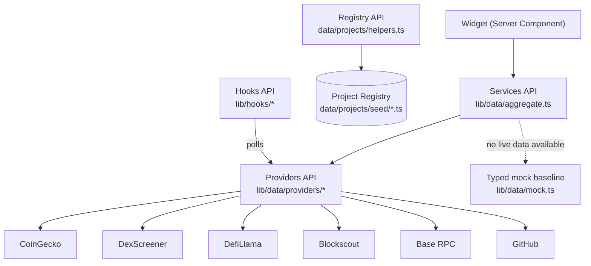

# API

Base Radar does not currently expose an HTTP API. There is no `app/api`
route handler in the codebase — every "API" described below is an
**internal TypeScript function boundary** between layers of the same
Next.js application, called directly (`await getX()`) from Server
Components. This document catalogs those internal interfaces as they exist
today, plus the internal interfaces and endpoints that are planned but not
yet built.

For how these layers fit together structurally, see
[ARCHITECTURE.md](ARCHITECTURE.md). This document is the reference for what
each function actually takes and returns.

## Internal Architecture

```
 Widget (Server Component)
        │  calls
        ▼
 Services API        lib/data/aggregate.ts   — one function per widget's data need
        │  calls
        ▼
 Providers API        lib/data/providers/*    — one module per external data source
        │  calls
        ▼
 External APIs        CoinGecko, DexScreener, DefiLlama, Blockscout, Base RPC, GitHub

 Registry API         data/projects/helpers.ts — reads static, in-memory data (no network)

 Hooks API             lib/hooks/*             — client-side wrapper around a subset
                                                    of the above, for polling
```



Three properties hold across every internal API in this system:

- **Providers never throw.** Every provider function resolves to `null` on
  failure instead of throwing, so a failing external API degrades one field
  rather than crashing a page.
- **Services never throw either.** Aggregator functions in `aggregate.ts`
  catch internally and fall back to typed mock data; a widget can always
  render.
- **Every services-layer result is source-tagged.** Return types are
  `WithSource<T> = T & { source: "live" | "mock" }`, so callers (and,
  transitively, the UI) always know whether a result is real-time or
  fallback data.

## Current Helper Functions

### Services API — `lib/data/aggregate.ts`

This is the API surface every widget actually consumes. Each function takes
no arguments and resolves to a `WithSource<T>` (or an array with a `source`
property attached via `Object.assign`).

| Function | Returns | Backed by |
| --- | --- | --- |
| `getKpis()` | `WithSource<{ items: Kpi[] }>` | DefiLlama, Base RPC, CoinGecko, Blockscout |
| `getMarketOverview()` | `WithSource<MarketOverview>` | Base RPC |
| `getPortfolioSummary()` | `WithSource<PortfolioSummary>` | Mock only — no wallet connect yet |
| `getTrendingNarratives()` | `WithSource<Narrative[]>` | Mock only — no classification provider yet |
| `getAIProjects()` | `WithSource<AIProject[]>` | CoinGecko |
| `getWhaleEvents()` | `WithSource<WhaleEvent[]>` | Mock only — no free whale-indexing provider |
| `getSignals()` | `WithSource<Signal[]>` | DexScreener |
| `getProjectSpotlight()` | `WithSource<ProjectSpotlight>` | DefiLlama, CoinGecko, GitHub |
| `getActivityFeed()` | `WithSource<ActivityEvent[]>` | GitHub, DexScreener, Blockscout |
| `getWelcomeStats()` | `WithSource<WelcomeStats>` | DefiLlama, Base RPC, GitHub |
| `getIntelligenceBrief()` | `WithSource<IntelligenceBrief>` | Composed from `getKpis`, `getMarketOverview`, `getWelcomeStats`, `getSignals` |
| `getNarrativeHeatmap()` | `WithSource<NarrativeHeatRow[]>` | Mock only — curated, no classification provider yet |
| `getWatchlist()` | `WithSource<WatchlistItem[]>` | Mock only — requires accounts/wallet connect |
| `getLiveTicker()` | `WithSource<LiveTicker>` | Base RPC, CoinGecko, DefiLlama, Blockscout |
| `getDashboardData()` | `DashboardData` (all of the above, fanned out via `Promise.all`) | — |

`DashboardData` is the single object `app/dashboard/page.tsx` destructures
to render every widget; `getLiveTicker()` is called separately by
`app/dashboard/layout.tsx` for the shell's status bar.

### Providers API — `lib/data/providers/*`

Each function talks to exactly one external API and resolves to typed data
or `null` — never a raw HTTP error.

| Module | Function | Signature | Notes |
| --- | --- | --- | --- |
| `baseRpc.ts` | `getBaseNetworkStatus()` | `(): Promise<{ gasGwei, blockHeight, txCountLatestBlock, estimatedTps, chainId } \| null>` | Base mainnet JSON-RPC |
| `blockscout.ts` | `getChainStats()` | `(): Promise<ChainStats \| null>` | Total addresses/transactions, daily tx count, block time, utilization |
| `blockscout.ts` | `getRecentlyVerifiedContract()` | `(): Promise<VerifiedContract \| null>` | Powers the activity feed's verification event |
| `coingecko.ts` | `getBaseEcosystemMarkets(perPage = 20)` | `(perPage?: number): Promise<CoinGeckoMarket[] \| null>` | Market data filtered to the `base-ecosystem` category |
| `coingecko.ts` | `getMajorPrices()` | `(): Promise<MajorPrices \| null>` | ETH + BTC price and 24h change |
| `coingecko.ts` | `getEthPrice()` | `(): Promise<{ usd, changePct24h } \| null>` | Exported but not currently called by any aggregator function |
| `defillama.ts` | `getBaseChainTvl()` | `(): Promise<{ tvlUsd, changePct24h } \| null>` | |
| `defillama.ts` | `getBaseStablecoinMcap()` | `(): Promise<number \| null>` | |
| `defillama.ts` | `getBaseProtocols()` | `(): Promise<LlamaProtocol[] \| null>` | |
| `defillama.ts` | `getTopBaseProtocol()` | `(): Promise<LlamaProtocol \| null>` | Highest-TVL Base protocol; feeds Project Spotlight |
| `defillama.ts` | `getBaseProjectCount()` | `(): Promise<number \| null>` | Exported but not currently called by any aggregator function |
| `dexscreener.ts` | `getBaseTrendingPairs()` | `(): Promise<DexScreenerPair[] \| null>` | |
| `github.ts` | `getRepoStats(fullName)` | `(fullName: string): Promise<RepoStats \| null>` | Stars, forks, open issues, latest release |

### Registry API — `data/projects/helpers.ts`

Synchronous, in-memory reads over the static Project Registry — no network
calls, no `source` tagging (there is no live/mock distinction for static
data).

| Function | Signature | Behavior |
| --- | --- | --- |
| `getProjects()` | `(): Project[]` | Every project, in seed order |
| `getProject(idOrSlug)` | `(idOrSlug: string): Project \| undefined` | Match by `id` or `slug` |
| `getProjectsByCategory(category)` | `(category: ProjectCategory): Project[]` | Filter by category membership |
| `getProjectsByTag(tag)` | `(tag: ProjectTag): Project[]` | Filter by tag membership |
| `getProjectsByVerificationStatus(status)` | `(status: VerificationStatus): Project[]` | Filter by verification status |
| `searchProjects(query)` | `(query: string): Project[]` | Case-insensitive match across name, short description, tags, categories; empty string returns `[]` |

All are re-exported from the `data/projects` barrel alongside the `Project`
type, enums, and `PROJECTS` (the full array).

### Hooks API — `lib/hooks/*`

Client-only wrappers that own a polling or ticking lifecycle. Not a data
API in themselves — both currently call into the Providers/Services APIs
above.

| Hook | Signature | Behavior |
| --- | --- | --- |
| `useLiveNetworkStatus(pollMs = 45000)` | `(pollMs?: number): { status: LiveNetworkStatus \| null, updatedAt: number \| null }` | Polls `getBaseNetworkStatus()` on an interval |
| `useNowTick(intervalMs = 1000)` | `(intervalMs?: number): number` | Re-renders on an interval so relative timestamps stay current; fetches nothing |

### Formatting utilities — `lib/data/format.ts`

Pure functions, not part of the data-flow API, but used throughout the UI
layer to render values consistently: `formatCompactCurrency`,
`formatPrice`, `formatCompactNumber`, `formatNumber`, `formatGwei`,
`formatPercent`, `formatRelativeTime`.

## Provider Layer

Each provider module wraps exactly one external API. This section documents
what each one is used for, which endpoints it calls, its current caching
window, and what's known about its rate limits. See
[docs/DATABASE.md](DATABASE.md#caching-strategy) for the full caching
strategy discussion.

### CoinGecko

- **Module**: `lib/data/providers/coingecko.ts`
- **Used for**: Base-ecosystem market data (`getBaseEcosystemMarkets`), major
  asset prices (`getMajorPrices`, `getEthPrice`)
- **Endpoint base**: `https://api.coingecko.com/api/v3` (public, free tier,
  no API key)
- **Cache window**: 90s (`next: { revalidate: 90 }`)
- **Rate limits**: CoinGecko's public free-tier API enforces a per-minute
  call budget (their own docs are the source of truth for the current
  number, since free-tier limits change over time). Base Radar does not
  authenticate, so it shares the anonymous/IP-based limit. The 90s cache
  window keeps this comfortably under typical free-tier budgets for a
  single-server deployment.

### DexScreener

- **Module**: `lib/data/providers/dexscreener.ts`
- **Used for**: Trending Base pairs (`getBaseTrendingPairs`) — powers
  Signals and part of the Activity Feed
- **Endpoint base**: DexScreener's public API (no key required)
- **Cache window**: 60s
- **Rate limits**: Not authenticated; subject to DexScreener's public rate
  limiting for unauthenticated clients. Mitigated the same way — via the
  60s revalidate window rather than a bespoke client-side limiter.

### DefiLlama

- **Module**: `lib/data/providers/defillama.ts`
- **Used for**: Base chain TVL, stablecoin market cap, protocol list, and
  top-protocol lookup (`getBaseChainTvl`, `getBaseStablecoinMcap`,
  `getBaseProtocols`, `getTopBaseProtocol`, `getBaseProjectCount`)
- **Endpoint base**: `https://api.llama.fi` (free, no API key)
- **Cache window**: 120s for most calls. The `/protocols` payload is
  multi-megabyte and deliberately **not cached** (`cache: "no-store"`) —
  see [docs/DATABASE.md](DATABASE.md#caching-strategy) for why.
- **Rate limits**: DefiLlama's free API has no documented hard rate limit
  at the time of writing, but the `/protocols` endpoint being uncached
  means every call to functions that depend on it hits the network fresh —
  this is a deliberate size/cache tradeoff, not a rate-limit workaround.

### Blockscout

- **Module**: `lib/data/providers/blockscout.ts`
- **Used for**: Chain stats (`getChainStats`) and recently verified
  contracts (`getRecentlyVerifiedContract`)
- **Endpoint base**: `https://base.blockscout.com/api/v2` (Base's public
  Blockscout instance, no API key)
- **Cache window**: 60s
- **Rate limits**: Public instance rate limiting applies; no API key is
  used, so requests share the anonymous quota for `base.blockscout.com`.

### Base RPC

- **Module**: `lib/data/providers/baseRpc.ts`
- **Used for**: Live network status — gas price, block height, tx count,
  estimated TPS (`getBaseNetworkStatus`)
- **Endpoint**: `https://mainnet.base.org` (Base's public JSON-RPC
  endpoint, no API key)
- **Cache window**: 20s — the shortest of any provider, since gas price and
  block height are the most time-sensitive values in the dashboard.
- **Rate limits**: Public node providers typically apply IP-based request
  limits; see
  [docs.base.org/base-chain/tools/node-providers](https://docs.base.org/base-chain/tools/node-providers)
  for current guidance. A dedicated/paid RPC provider would be a natural
  upgrade if this endpoint's shared limits become a bottleneck.

### GitHub

- **Module**: `lib/data/providers/github.ts`
- **Used for**: Repository stats and release activity (`getRepoStats`) for
  known Base protocol repos and the Activity Feed
- **Endpoint base**: `https://api.github.com` (public REST API, called
  **unauthenticated**)
- **Cache window**: 600s (10 minutes) — the longest of any provider, since
  repo stats change slowly
- **Rate limits**: GitHub's unauthenticated REST API is capped at **60
  requests/hour per IP** — explicit and enforced. The long cache window
  exists specifically to stay well under this limit. Adding a GitHub token
  (raising the limit to 5,000 requests/hour) is a natural future change,
  but is not required today at current traffic levels.

## Alert Engine & AI Intelligence API

Internal function reference for `lib/alerts/`. See
[ARCHITECTURE.md](ARCHITECTURE.md#alert-engine--ai-intelligence) for how
these fit together as a pipeline.

### Service — `lib/alerts/service.ts`

Stateful (module-level cache + `subscribe`/`notify`), unlike the stateless
Services API above — this is what backs `useSyncExternalStore` in the hooks
below.

| Function | Returns | Notes |
| --- | --- | --- |
| `refreshAlerts()` | `Promise<void>` | Runs all five alert providers via `Promise.allSettled` and replaces the live alert content. Called once automatically on first client load; safe to call again manually. |
| `getAlerts()` | `Alert[]` | Every current alert, unfiltered by Watchlist membership. |
| `getVisibleAlerts()` | `Alert[]` | Watched AND not muted — what the Alerts page, Sidebar badge, and Topbar bell read from. |
| `getAlertsForWatchlist()` | `Alert[]` | Watched, ignoring each project's mute toggle. |
| `getIntelligenceAlerts()` | `IntelligenceAlert[]` | One rolled-up AI Intelligence read per watched project, built from `getVisibleAlerts()`. Same array reference until the next real recomputation. |
| `getWatchlistProjectsWithAlerts()` | `WatchlistProjectAlertInfo[]` | One row per watched project — name, alert preference, alert count. |
| `isAlertEnabled(projectId)` / `toggleProjectAlerts(projectId)` | `boolean` / `void` | Per-project alert mute preference. |
| `markRead` / `markUnread` / `markAllRead` / `pin` / `unpin` / `togglePin` / `dismiss` | `void` | Per-alert user state, persisted to `localStorage`. |
| `filterAlerts(alerts, options)` / `sortAlerts(alerts, order)` | `Alert[]` | Pure — filter/sort raw alerts without touching the cache. |
| `filterIntelligenceAlerts(alerts, options)` / `sortIntelligenceAlerts(alerts, order)` | `IntelligenceAlert[]` | Pure — filter/sort an already-built `IntelligenceAlert[]`. Never calls `buildIntelligenceAlerts` again. |
| `subscribe(listener)` | `() => void` | Registers a listener for the next mutation/refresh/Watchlist change; returns an unsubscribe function. |

### AI Intelligence Engine — `lib/alerts/intelligence/`

| Function | Module | Returns |
| --- | --- | --- |
| `buildIntelligenceAlerts(alerts)` | `engine.ts` | `IntelligenceAlert[]` — the full pipeline (group → score → detect narrative → summarize), sorted by score. Pure. |
| `scoreAlert(alert)` | `scoring.ts` | `IntelligenceSignal \| null` — runs every category scorer, returns whichever applies. |
| `computeScore(signals)` / `computeConfidence(signals)` / `computeNetSentiment(signals)` | `scoring.ts` | `number` — magnitude, category-diversity confidence, and signed sentiment respectively. |
| `classifyDirection(alert)` | `scoring.ts` | `-1 \| 0 \| 1` — reads the alert's own title for a real direction keyword. |
| `groupAlertsByProject(alerts)` | `grouping.ts` | `ProjectAlertGroup[]` |
| `detectNarrative(signals)` | `narratives.ts` | `NarrativeType` — one of `growth`, `decline`, `governance-active`, `security-risk`, `accumulation`, `development-active`, `stable`. |
| `buildHeadline` / `buildSummary` / `buildReasoning` | `summary.ts` | `string` — deterministic template prose, no AI API. |

### Hooks — `lib/hooks/`

| Hook | Backed by | Notes |
| --- | --- | --- |
| `useIntelligenceAlerts()` | `service.getIntelligenceAlerts()` | `useSyncExternalStore` binding, same pattern as `useAlerts`/`useVisibleAlerts`. |
| `useExecutiveSummary()` | `useIntelligenceAlerts()` | Aggregates narrative counts, average confidence, and highest score — the one place these stats are computed; components only format the result. |

## Future Provider Interfaces

These are internal interfaces the codebase is already shaped for but does
not implement yet. Each would live in `lib/data/providers/` and follow the
existing contract (typed success shape or `null`, never throw), so no
existing widget or aggregator function would need to change shape — only
its call site in `aggregate.ts` would start awaiting a real provider instead
of returning mock data.

| Planned provider interface | Would replace | Status |
| --- | --- | --- |
| Wallet balances provider | `getPortfolioSummary()`'s mock data | Planned — requires wallet connect, no free API exists for this today |
| Whale-transfer indexing provider | `getWhaleEvents()`'s mock data | Planned — noted in code as requiring a paid API (e.g. Whale Alert) |
| Narrative/category classification provider | `getTrendingNarratives()` and `getNarrativeHeatmap()`'s mock data | Planned — no free API currently exposes this classification |
| Registry-to-live-data join | New function(s) reading both `data/projects` and `lib/data/providers` | Planned — every `Project` already carries the `providerIds` this would key off |

## Future API Endpoints

Base Radar has no `app/api` routes today; every internal interface above is
a plain function call within the same server process, not an HTTP
boundary. The following are **planned, not implemented** — they would only
become necessary once a client needs to fetch data independently of a
Server Component render (e.g. a searchable Projects Explorer, or a public
integration surface):

| Planned endpoint | Purpose |
| --- | --- |
| `GET /api/projects` | List/search the Project Registry — a thin HTTP wrapper over `getProjects()` / `searchProjects()` |
| `GET /api/projects/[slug]` | Single project detail — wraps `getProject(idOrSlug)` |
| `GET /api/dashboard` | JSON snapshot of `getDashboardData()`, for a client-side refresh without a full page reload |
| `GET /api/signals` | Standalone signals feed, if Signals & Alerts becomes its own page independent of the dashboard grid |

None of these exist yet. They are listed here because the current function
signatures in `aggregate.ts` and `helpers.ts` are already shaped to sit
directly behind a route handler with minimal adaptation, not because any
route handler has been scaffolded.
