# Architecture

This document explains how Base Radar is put together as a system: the
layers it's built from, how data moves through it, and how the major
subsystems (dashboard, theming, routing, Project Registry) fit together. It
describes the system the way an engineer joining the project would want it
explained — not a line-by-line tour of the code.

For product framing, see [PRODUCT_VISION.md](PRODUCT_VISION.md). For the
Project Registry's schema in detail, see [PROJECT_REGISTRY.md](PROJECT_REGISTRY.md).

## Overall Architecture

Base Radar is a single Next.js App Router application. There is no separate
backend service — "backend" logic lives inside the Next.js server (Server
Components and plain async functions), and "frontend" logic lives in Client
Components. Everything ships from one codebase, one deploy.

The system is organized as a strict layered pipeline for data, and a
conventional component tree for UI:

```
 ┌─────────────────────────────────────────────────────────┐
 │                        UI Layer                          │
 │   app/ (routes)  →  components/ (dashboard, landing, ui) │
 └───────────────────────────┬───────────────────────────────┘
                              │ reads typed data, never fetches directly
 ┌───────────────────────────▼───────────────────────────────┐
 │                       Hooks Layer                          │
 │              lib/hooks/  (client-side polling)             │
 └───────────────────────────┬───────────────────────────────┘
                              │
 ┌───────────────────────────▼───────────────────────────────┐
 │                      Services Layer                        │
 │              lib/data/aggregate.ts (the aggregator)         │
 └───────────────────────────┬───────────────────────────────┘
                              │
 ┌───────────────────────────▼───────────────────────────────┐
 │                      Providers Layer                       │
 │      lib/data/providers/*  (one module per external API)   │
 └───────────────────────────┬───────────────────────────────┘
                              │
 ┌───────────────────────────▼───────────────────────────────┐
 │           External APIs (CoinGecko, DexScreener,            │
 │        DefiLlama, Blockscout, Base RPC, GitHub)              │
 └─────────────────────────────────────────────────────────────┘

 ┌─────────────────────────────────────────────────────────┐
 │                    Project Registry                       │
 │         data/projects/  (static, versioned, typed)         │
 └─────────────────────────────────────────────────────────┘
```

The Project Registry sits beside this pipeline rather than inside it: it is
static, curated data, not a live provider response. It is designed to be
*joined* with the live pipeline later (registry entries already carry
provider identifiers for this purpose), but today the two are independent.

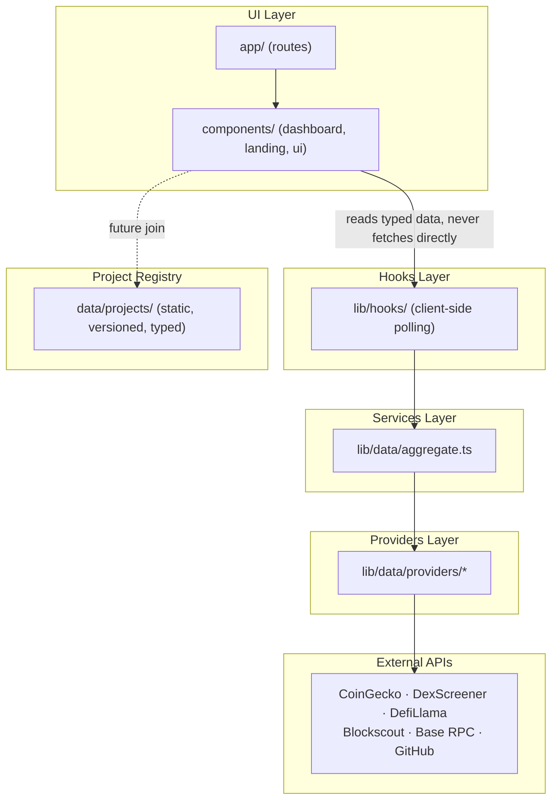

## Folder Structure

```
app/                     Routes (App Router) — pages and layouts only
  page.tsx                 Landing page route
  layout.tsx                Root layout: fonts, ThemeProvider
  dashboard/
    page.tsx                Dashboard route — fetches data, renders widgets
    layout.tsx               Dashboard shell layout — fetches the live ticker
  globals.css               Tailwind v4 theme tokens, light/dark variables

components/
  landing/                 Landing-page-only components (Hero, background)
  layout/                   Shared chrome used by the landing page (Navbar, Footer)
  dashboard/                Dashboard shell + all widgets
  ui/                       Generic, reusable primitives (cards, buttons, tooltips)

constants/                 Static config/content (nav links, dashboard nav groups, mock stat content)

data/projects/             The Project Registry (see below)

lib/
  data/
    types.ts                 Shared data contracts for every widget
    mock.ts                  Typed mock baseline for every contract
    aggregate.ts              The services layer — one function per widget's data need
    providers/                One module per external API (the providers layer)
  hooks/                     Client-side hooks that own polling/refresh lifecycles
  utils.ts                   Small shared helpers (e.g. `cn` for class names)

docs/                       Project documentation (this file included)
public/                     Static assets
```

The rule of thumb: **`app/` decides what renders where, `components/`
decides how it looks, `lib/` decides where data comes from, `data/`
decides what's canonically true.**

## How Data Flows

Every widget on the dashboard follows the same round trip, whether or not a
live provider actually responds:

```
 Widget (Server Component)
        │
        │ await getX() from lib/data/aggregate.ts
        ▼
 Aggregator function
        │
        │ calls one or more providers, in parallel where possible
        ▼
 Provider module(s)
        │
        │ fetch() against a public API, or resolve to null on failure
        ▼
 Aggregator merges live results onto the typed mock baseline
        │
        │ returns { ...data, source: "live" | "mock" }
        ▼
 Widget renders the data, and can show its source honestly
```

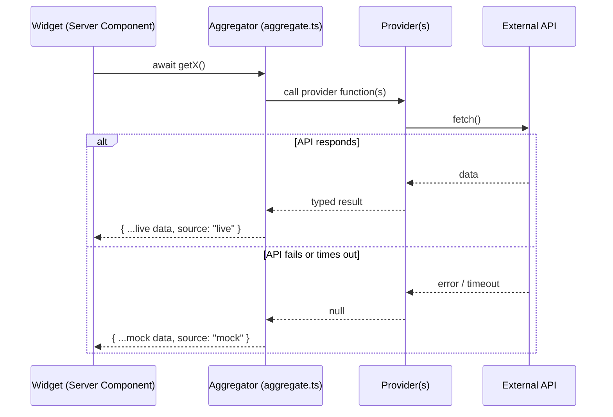

Two properties make this resilient:

- **Providers never throw.** A failed or slow request resolves to `null`;
  the caller decides what to do next. A single flaky API can never crash a
  page render.
- **Every result is tagged with its source.** The `WithSource<T>` type
  (`{ ...T, source: "live" | "mock" }`) travels all the way to the UI, so the
  dashboard can be honest about whether a given number is real-time or a
  fallback — instead of silently presenting mock data as live.

`app/dashboard/page.tsx` calls a single `getDashboardData()` function that
fans out to every aggregator function in parallel and returns one object the
page renders from. `app/dashboard/layout.tsx` separately fetches the live
ticker, since the status bar it powers is shell chrome rather than page
content.

## UI Layer

The UI layer is plain React composition, split by ownership rather than by
technical concern:

- **`components/landing/`** — only used by the marketing page (`app/page.tsx`).
- **`components/layout/`** — chrome shared across the marketing site (navbar, footer).
- **`components/dashboard/`** — the dashboard shell (sidebar, topbar, mobile
  nav) and every widget. Widgets are presentational: they receive already-
  resolved, typed data as props and render it. They do not fetch data
  themselves.
- **`components/ui/`** — generic primitives with no domain knowledge
  (`GlassCard`, `Tooltip`, `Sparkline`, `AnimatedNumber`, `EmptyState`,
  shadcn-derived `button`/`skeleton`), reused by both the landing page and
  the dashboard.

Dashboard pages are Server Components by default (so data fetching can use
plain `await`); components that need interactivity (search, theme toggle,
mobile nav, animated counters) are explicitly marked `"use client"` and kept
as small, focused leaves in the tree rather than large client subtrees.

## Hooks Layer

`lib/hooks/` is a thin layer that exists specifically for **client-side,
time-based** data needs — the one category of data access that Server
Components can't handle, because it requires an interval running in the
browser after the page has loaded.

- **`useLiveNetworkStatus`** — polls Base network status on an interval so
  the topbar's network badge can update without a full page reload.
- **`useNowTick`** — re-renders a component once a second so relative
  timestamps ("Updated 12s ago") stay fresh without re-fetching anything.

The rule this layer enforces: **components never import from
`lib/data/providers/*` directly for anything that needs to refresh on an
interval.** They call a hook, and the hook owns the polling lifecycle
(setup, teardown, cancellation). Everything that only needs to be fetched
once per page load is fetched directly in a Server Component instead — the
hooks layer is deliberately reserved for the polling case, not used as a
general data-fetching abstraction.

## Services Layer

`lib/data/aggregate.ts` is the single module every UI component is expected
to import data from. It is the only place that:

- Knows which provider(s) back a given widget.
- Decides how to merge a live response onto the mock baseline (e.g. patch
  individual KPI values as each provider resolves, rather than
  all-or-nothing).
- Decides what a widget does when a data category simply isn't available
  from any free provider yet (portfolio balances and whale-transfer
  indexing are documented, intentional mock-only cases, not bugs).

This indirection means swapping a provider, adding a paid one later, or
changing how two providers are blended only ever means editing a single
function body in `aggregate.ts` — no widget changes.

## Providers Layer

`lib/data/providers/` holds one module per external API, each responsible
only for talking to that API and shaping its response into a plain,
typed result:

| Module | API |
| --- | --- |
| `baseRpc.ts` | Base mainnet public JSON-RPC |
| `blockscout.ts` | Blockscout (Base explorer) REST API |
| `coingecko.ts` | CoinGecko public market data API |
| `defillama.ts` | DefiLlama protocol/TVL API |
| `dexscreener.ts` | DexScreener public API |
| `github.ts` | GitHub REST API |

Every provider function follows the same contract: return the parsed data,
or `null` if anything goes wrong — never throw, never leak a raw fetch
error upward. Providers know nothing about each other and nothing about how
their data will be combined; that decision belongs entirely to the services
layer above them.

## Project Registry

`data/projects/` is a static, strongly-typed, version-controlled dataset —
architecturally distinct from the live pipeline above:

```
 data/projects/
   enums.ts     Categories, tags, status, chains, verification levels, contract types
   types.ts     The `Project` schema
   helpers.ts    Query functions (getProject, searchProjects, getProjectsByCategory, ...)
   metrics.ts    Registry Metrics model (PR-037)
   quality-score.ts  Quality Score weighting model (PR-037)
   index.ts      Public barrel export
   seed/
     index.ts     Aggregates every seed file into one array
     <slug>.ts     One file per project
```

Each project carries identity and branding data, verification metadata, and
a `providerIds` block (CoinGecko id, DexScreener chain, DefiLlama slug,
Blockscout address, etc.) — lookup keys that a future integration can use
to join a registry entry with live data from the providers layer above,
without changing the registry's shape. Nothing in `data/projects/` performs
network requests; it is deliberately inert, canonical data.

**PR-037 — Registry foundation model**: three optional, additive fields
(`lifecycle`, `verificationLevel`, `qualityScore`) extend `Project` to
support a future discovery/ingestion pipeline, without changing any
existing seed data or behavior. `lifecycle` separates the registry
record's own state (active/inactive/archived/duplicate/migrated/scam) from
`status` (the real product's operational state) and from
`verification`/`verificationLevel` (editorial trust and pipeline
progress). See `docs/PROJECT_REGISTRY.md` for the full specification,
including the category taxonomy audit, discovery source list, registry
metrics model, and quality score weighting.

**PR-039 — Discovery Engine** (`lib/discovery/`): the pipeline that
actually produces `DiscoverySource`-tagged candidates — `CandidateProject`s
collected by one `DiscoveryProvider` per source, deduplicated against
`data/projects/` via `findDuplicateMatches()`, and modeled as
`DiscoveryQueueEntry` records awaiting review. Architecturally sits beside
the Project Registry, the same way the providers layer does: it reads
`data/projects/` (for duplicate comparison) but never writes to it — no
route or job converts an accepted candidate into a `Project` yet. See
`docs/DISCOVERY_ENGINE.md`.

## Dashboard Architecture

The dashboard is a shell plus a grid of independent widgets:

```
 DashboardLayout
   ├── Sidebar / MobileSidebar        (navigation)
   ├── Topbar                          (breadcrumb, search, network status, user menu)
   ├── LiveStatusBar                   (persistent live ticker strip)
   └── main
        └── DashboardPage
             ├── WelcomeHeader
             ├── IntelligenceBrief
             ├── KPIRow
             └── Widget grid: Portfolio · Market · Trending ·
                 AI Projects · Whale Activity · Signals ·
                 Narrative Heatmap · Project Spotlight ·
                 Activity Feed · Watchlist
```

Every widget is wrapped in a shared `WidgetCard`, giving all of them the
same last-updated timestamp treatment and action menu regardless of what
they render internally. This keeps the grid visually consistent even though
each widget's data shape and content are unrelated. The layout also reserves
(but does not yet populate) a right-hand "Intelligence Rail" region for
future desktop-only content, without requiring another layout change when
that ships.

## Alert Engine & AI Intelligence

The Alert Engine and its AI Intelligence layer are a self-contained
subsystem under `lib/alerts/` — additive to everything above, not a
replacement for the Services/Providers layers. It reuses the existing
Providers Layer (CoinGecko, DefiLlama, Blockscout, GitHub) plus the
Governance provider (Snapshot) exclusively; no new external integration was
added to build it, and there is no polling, no websocket, no cron, and no
backend/API route involved anywhere in it.

```
lib/alerts/
  types.ts, constants.ts, storage.ts   Alert model, versioning, SSR-safe localStorage overlay
  providers/                            One AlertProvider per source (github, snapshot, coingecko, defillama, blockscout) + aggregator
  service.ts                            Stateful service layer — the one place every cached, derived view lives
  intelligence/
    types.ts                            IntelligenceSignal / NarrativeType / IntelligenceAlert models
    scoring.ts                          One modular scorer per alert category → IntelligenceSignal
    grouping.ts                         Groups an Alert[] by project
    narratives.ts                       Fixed-priority rules: signals → one NarrativeType
    summary.ts                          Deterministic template prose (headline/summary/reasoning/next step)
    engine.ts                           buildIntelligenceAlerts(): the pure pipeline entry point
```

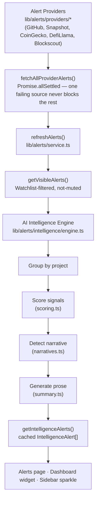

**Pipeline** (`engine.ts`'s `buildIntelligenceAlerts`, a pure function — same
input always produces the same output, no randomness, no network call):

1. **Collect** — the caller passes in an already-fetched `Alert[]`
   (`getVisibleAlerts()`'s current Watchlist-filtered feed, not the
   unfiltered set — the point is fewer, smarter signals for what the user
   actually watches).
2. **Group by project** (`grouping.ts`).
3. **Score** (`scoring.ts`) — one small, independent scorer per alert
   category (TVL, governance, GitHub activity, contract/security event,
   whale transfer, price movement). Each reads the alert's real `severity`
   for magnitude and its real title text for direction (keywords the
   providers themselves already write, e.g. "Increased"/"Decreased"/
   "Passed"/"Failed" — never invented sentiment). An alert whose category no
   scorer recognizes yet contributes no signal, honestly, rather than a
   guessed one.
4. **Detect narrative** (`narratives.ts`) — a fixed-priority rule chain over
   the real signal categories present (a security signal always wins; a
   "growth"/"decline" read requires at least two independent corroborating
   categories; a single-category read maps to a narrower narrative like
   "accumulation" or "development-active"; no rule match falls back to
   "stable" rather than a forced guess).
5. **Generate an executive summary** (`summary.ts`) — deterministic template
   prose built only from real, already-computed values (the project name,
   the real signal labels, real counts). This is what makes the output
   *read* like an AI wrote it without an AI API being involved anywhere.
   Alongside the headline/summary/reasoning, `summary.ts` also assigns a
   short `nextStep` (PR-009) — a fixed, narrative-keyed pointer to where the
   user should look next (e.g. a security-risk narrative always points at
   the Project Profile's Contracts section). It's a lookup table keyed on
   the same real, already-detected `narrative`, never a project-specific
   claim invented beyond what the signals support.
6. **Expose** — one `IntelligenceAlert` per project, sorted by score
   (highest-signal projects first). This score-descending order *is* the
   alert prioritization: a project's score is the sum of its real signal
   weights (TVL change, governance activity, GitHub activity, contract/
   security events, whale transfers, price movement — each weighted by
   real severity), so the alerts that surface first are always whichever
   real, currently-scoreable events carry the most combined weight — never
   an arbitrary or chronological ordering. A `security-risk` narrative is
   the one case that always wins narrative *classification* regardless of
   score (`narratives.ts`), though the sort itself remains score-based.

**Severity vs. direction**: this codebase's `AlertSeverity` is not a pure
sentiment axis (a large *upward* price move and a large *downward* one can
both be `critical`), so `scoring.ts` keeps two axes separate — severity
scales a signal's magnitude only; a small keyword classifier reads the
alert's own title for direction. **Confidence** scales with the number of
*distinct* signal categories corroborating a read, not raw alert count —
three alerts about the same TVL swing is one real signal, not three
independent confirmations.

**UI components** (`components/alerts/`): `IntelligenceCard`,
`IntelligenceList`, `IntelligenceFilters`, `IntelligenceBadge`,
`ConfidenceBar`, `SignalPills`, `NarrativeBadge`, `ExecutiveSummary` — all
presentational, reading from hooks rather than computing anything
themselves. Surfaced on the Alerts page (above the raw alert feed),
a compact Dashboard widget (`AIIntelligenceWidget`, top 3 by score), and an
additive sparkle indicator on the Sidebar's Alerts nav item. `IntelligenceCard`
renders `alert.nextStep` alongside its existing headline/summary (PR-009).

**PR-012 — making the pipeline's own output explainable**: every field this
section adds UI for already existed on `IntelligenceAlert`; PR-012 changed
zero scoring/confidence math and added zero new fields.
- **Evidence flow (Step 3 → `SignalPills`)**: `SignalPills` used to render
  `alert.signals`' distinct categories in whatever order the underlying
  `Alert[]` happened to arrive in. It now orders them by
  `CATEGORY_EVIDENCE_PRIORITY` (`components/alerts/meta.ts`) — Security →
  TVL → GitHub (`release`) → Governance → Whale Activity → Price, the same
  six categories `scoring.ts` can actually produce a signal for, in the same
  priority `narratives.ts` already gives security. Categories that didn't
  contribute a real signal are never shown — no placeholder pip, no implied
  category.
- **Reasoning/confidence flow (Step 4 →`ConfidenceBar`)**: `computeConfidence`
  (`scoring.ts`) scales with how many *distinct* signal categories agree;
  `ConfidenceBar` now takes those same categories as an optional prop and
  prints them under the percentage — "Security + TVL signals" — so the
  number is explained in the same real terms that produced it, never a
  probability claim beyond what `computeConfidence` already asserts. A
  single contributing category reads as singular ("Security signal"), and
  the line is omitted entirely when there are none (a `stable`-narrative
  alert with no scoreable signals shows a bare 0%, never invented evidence).
- **`reasoning` field**: computed by `summary.ts`'s `buildReasoning` since
  PR15.3 Part 1 but never rendered anywhere until now — `IntelligenceCard`
  passes it to `ConfidenceBar` as a native `title` tooltip, so the same
  factual justification ("3 real signals across 2 categories...") is one
  hover away without duplicating the visible category line.
- **`nextStep` flow**: unchanged from PR-009 — still a fixed,
  narrative-keyed lookup, still rendered as `IntelligenceCard`'s "Next:"
  line.

**PR-013 — closing the Project Profile's one missing connection**: every
downstream surface (Timeline, Daily Brief, Portfolio Intelligence,
Notifications, Automation) already links back to a Project Profile, but the
reverse never existed — a Project Profile had no pointer forward into this
engine at all, a completely separate system from the page's own
pre-existing `lib/intelligence/` health/risk report. `ProfileRelatedIntelligence`
(`components/explorer/ProfileRelatedIntelligence.tsx`), rendered directly
under `ProfileHeader`, reads the same four client-side stores every other
AI Intelligence surface already reads (`useIntelligenceAlerts`, `useTimeline`,
`useDailyBrief`, `usePortfolioIntelligence`) and checks each for a real
`projectId` match against the project being viewed. A matching source
renders one small link to its real page (`/dashboard/alerts`,
`/dashboard/timeline`, `/dashboard/brief`, `/dashboard/portfolio`); a
non-matching source renders nothing — never a disabled or generic link.
None of those four routes accept a project-scoped query parameter today, so
no new routing or global state was introduced to pass one through; this is
presence-detection and navigation only, not a new filtering capability.

**PR-009 actionability pass**: across the Dashboard's compact intelligence
previews (`AIIntelligenceWidget`, `BriefWidget`, `PortfolioWidget`,
`NotificationWidget`, `AutomationWidget`, `TimelineWidget`), the single
highlighted item (top alert/opportunity/performer/latest notification/
automation/event) is now a real link to wherever a user should look next —
a Project Profile (via the same `getProject()` lookup `IntelligenceCard`
already uses) or the already-computed `TimelineEvent.link`/`Notification.link`/
`AutomationResult.link` field, reusing the stretched-link pattern
`IntelligenceCard` established rather than inventing a new one. `BriefWidget`
and `PortfolioWidget` also surface `DailyBrief.recommendations[0]` /
`PortfolioIntelligence.recommendations[0]` as a "Suggested next step" line —
both fields already existed and were computed by `sections.ts`'s
`buildRecommendations` (and already shown on the full `/dashboard/brief` and
`/dashboard/portfolio` pages) but were previously omitted from the compact
Dashboard preview.

**PR-011 personal context line**: `AIIntelligenceWidget` now leads its list
with `"{intelligenceAlerts.length} watched project(s) with notable signals
today"` — a direct count of the already-personalized `intelligenceAlerts`
array `usePersonalizedDashboard()` already produces (PR22 Part 2), not a
new computation. The word "watched" only appears when `isPersonalized` is
actually true; with Dashboard filtering off (or no active watchlist) the
same count reads "N project(s)" instead, since `intelligenceAlerts` is the
unfiltered, ecosystem-wide array in that case and calling it "watched"
would misdescribe it.

**Hooks** (`lib/hooks/`): `useIntelligenceAlerts` (a `useSyncExternalStore`
binding to `service.getIntelligenceAlerts()`, the same pattern
`useAlerts`/`useVisibleAlerts` already use) and `useExecutiveSummary` (the
one place narrative counts, average confidence, and highest score are
aggregated — components only format that output, never recompute it).

**Filtering/search/sorting** (also `lib/alerts/service.ts`):
`filterIntelligenceAlerts`/`sortIntelligenceAlerts` are pure functions over
an already-built `IntelligenceAlert[]` — they never call
`buildIntelligenceAlerts` again. Filtering by severity in the UI reuses each
alert's own real `severity` field, relabeled for the filter dropdown
("Critical"/"High"/"Medium"/"Low") rather than computing a second, hidden
tier.

## Daily Brief

`lib/brief/` (PR16) is a second, thinner executive-summary layer sitting
directly on top of the Alert Engine's own `getIntelligenceAlerts()` — never
on raw provider alerts, and never re-deriving anything the AI Intelligence
Engine already computed. Where an `IntelligenceAlert` summarizes ONE
project, a `DailyBrief` summarizes the whole current batch: one headline,
one executive summary, and a handful of sections (Market Summary, Top
Opportunities, Security/Governance/Development/TVL Highlights, Emerging
Narratives, Recommendations).

```
lib/brief/
  types.ts      DailyBrief model + BriefOpportunity/BriefHighlight/BriefNarrativeTrend
  sections.ts   One pure builder function per section, plus computeMarketStats
  summary.ts    Deterministic headline/executive-summary template prose
  engine.ts     buildDailyBrief(): the pure pipeline entry point
  storage.ts    cachedDailyBrief (pure runtime cache) + getDailyBrief()
```

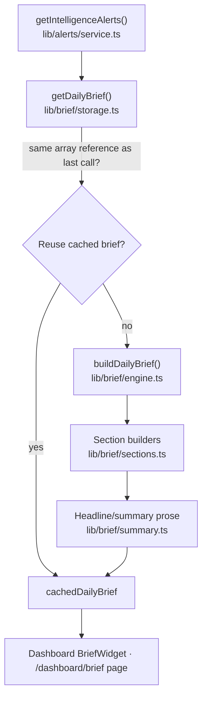

**Caching**: `storage.ts` keeps two module-level variables — the
`IntelligenceAlert[]` reference the brief was last built from, and the
resulting `DailyBrief`. `getDailyBrief()` rebuilds only when
`getIntelligenceAlerts()` returns a genuinely new array reference (that
service's own cached-snapshot contract already guarantees the reference
only changes on a real recompute), so repeated calls between real changes
are O(1). No `localStorage`, no backend — a pure in-memory cache that
resets on reload, by design.

**UI components** (`components/brief/`): `DailyBrief` (the page-level
orchestrator, `/dashboard/brief`), `BriefCard` (headline/summary/stats
hero), `BriefSection` (the shared icon+heading+content wrapper every
section reuses), `BriefMetric` (one label/value tile), `BriefWidget` (the
compact Dashboard preview), `RecommendationCard`, `NarrativeTrend`. Search
and the section filter live in `components/brief/filters.ts` — pure
functions over an already-built `DailyBrief`'s arrays, colocated with the
components rather than under `lib/brief/` specifically so they're never
mistaken for engine logic.

**Hooks** (`lib/hooks/`): `useDailyBrief` (a `useSyncExternalStore` binding
to `getDailyBrief()`, subscribed to the same listener set
`lib/alerts/service.ts` already exposes — there's no separate Brief
subscribe/notify pair, since a brief only ever changes when Intelligence
Alerts do) and `useBriefMetrics` (the one place the small metric-tile list
is assembled from the brief's own fields).

**Dashboard integration**: `BriefWidget` renders only the top-level summary
(headline, summary, 3 metrics, top opportunity, generated time) — never the
full section list, which lives at `/dashboard/brief` only.

## Portfolio Intelligence

`lib/portfolio/` (PR17) is a third executive-summary layer, one level above
Daily Brief — where a `DailyBrief` summarizes the day's Intelligence Alerts
market-wide, a `PortfolioIntelligence` summarizes them scoped to the
current Watchlist. It consumes exactly three existing services —
`getWatchlist()`, `getIntelligenceAlerts()`, `getDailyBrief()` — and calls
no provider directly.

```
lib/portfolio/
  types.ts      PortfolioIntelligence model + PortfolioHealth
  sections.ts   computePortfolioStats + 6 section builders
  summary.ts    Deterministic headline/executive-summary/health-label prose
  engine.ts     buildPortfolioIntelligence(): the pure pipeline entry point
  storage.ts    cachedPortfolioIntelligence (pure runtime cache) + getPortfolioIntelligence()
```

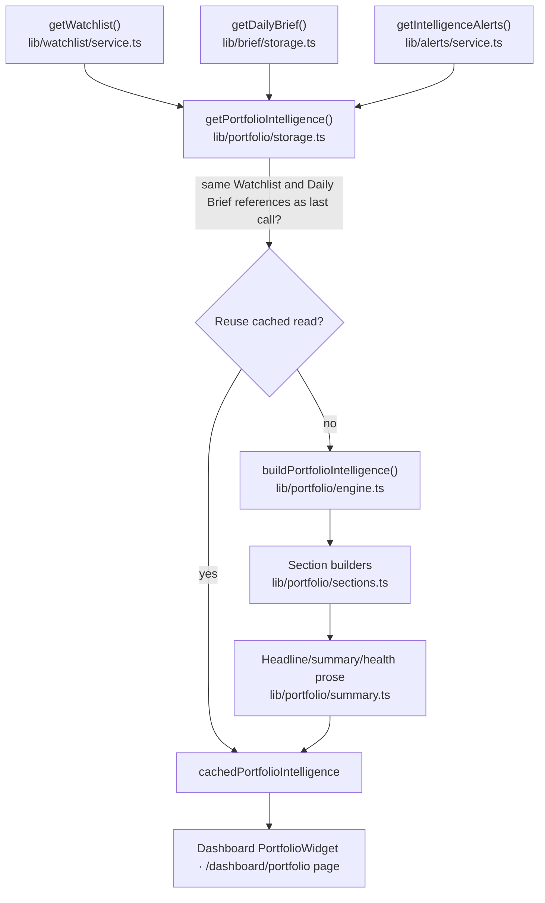

**Relationship with Daily Brief**: four of Portfolio Intelligence's six
sections (Top Performers, Security Risks, Governance Watch, Development
Momentum) are `DailyBrief`'s own already-computed sections, selected
unchanged — never re-filtered from `IntelligenceAlert[]` a second time.
Dominant Narratives is `DailyBrief.emergingNarratives`, capped to the top 3.
Only "Projects Needing Attention" is a genuinely new derivation — real
`"decline"`-narrative alerts, the one signal Daily Brief's own sections
never surface on their own. `projectCount` is deliberately the TRUE
Watchlist size (`getWatchlist().items.length`), not `DailyBrief.projectCount`
(which only counts watched projects that currently have a real Intelligence
Alert) — the gap between the two honestly reflects how much of the
Watchlist is currently silent.

**Caching**: `storage.ts` rebuilds only when `getWatchlist()` or
`getDailyBrief()` returns a new reference — both already guarantee stable
references between real changes, and Daily Brief's own reference already
changes whenever Intelligence Alerts do, so tracking it alone is sufficient
(no separate alerts-reference check needed).

**UI components** (`components/portfolio/`): `PortfolioOverview` (the
page-level orchestrator, `/dashboard/portfolio`), `PortfolioCard`
(headline/health/summary/stats hero), `PortfolioSection` (shared
icon+heading+content wrapper), `PortfolioMetric`, `PortfolioWidget` (compact
Dashboard preview), `PortfolioHealthBadge`, `NarrativeDistribution`,
`RecommendationCard`. Search and the section filter live in
`components/portfolio/filters.ts`, which re-exports
`components/brief/filters.ts`'s generic query helpers directly rather than
reimplementing them — Portfolio's reused sections are typed as the exact
same `BriefOpportunity[]`/`BriefHighlight[]`/`BriefNarrativeTrend[]` shapes.

**Hooks** (`lib/hooks/`): `usePortfolioIntelligence` (a
`useSyncExternalStore` binding to `getPortfolioIntelligence()`, subscribed
to BOTH `lib/alerts/service.ts`'s and `lib/watchlist/service.ts`'s listener
sets — the two real sources Portfolio Intelligence can change from) and
`usePortfolioMetrics` (the one place the small metric-tile list is
assembled from the portfolio's own fields).

**Dashboard integration**: `PortfolioWidget` renders only the top-level
summary (health badge, headline, summary, 3 metrics, top performer,
generated time) — never the full section list, which lives at
`/dashboard/portfolio` only.

## Intelligence Timeline

`lib/timeline/` (PR18) is a chronological aggregation layer, not another
intelligence engine — it consumes exactly three existing services
(`getIntelligenceAlerts()`, `getDailyBrief()`, `getPortfolioIntelligence()`)
and merges their output into one time-ordered `TimelineEvent[]` feed. It
computes no new scores, confidences, or narratives of its own.

```
lib/timeline/
  types.ts      TimelineEvent + Timeline models, 10 TimelineEventTypes
  sections.ts   10 event builders (1 per event type) + dedupe/sort/stats helpers
  summary.ts    Deterministic headline/summary prose
  engine.ts     buildTimeline(): the pure pipeline entry point
  storage.ts    cachedTimeline (pure runtime cache) + getTimeline()
```

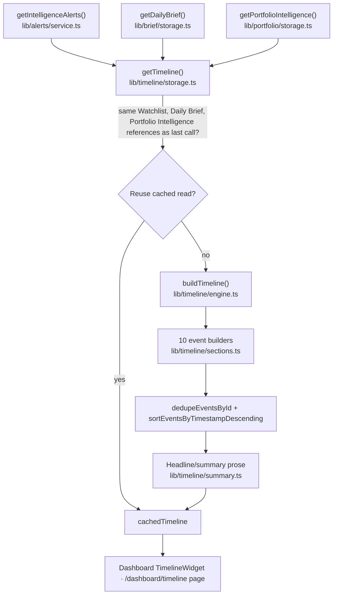

**Event model**: `TimelineEvent` carries `projectId`/`projectName`/
`severity`/`confidence`/`score`/`narrative`/`category`, all nullable —
`null` (never a fabricated placeholder) for the 4 aggregate-level event
types (`narrative`, `recommendation`, `portfolio`, `daily-brief`) that
genuinely aren't about a single project. The 6 project-scoped event types
(`alert`, `opportunity`, `security`, `governance`, `development`, `tvl`)
join back to the source `IntelligenceAlert` by `projectId` to recover the
richer fields `BriefOpportunity`/`BriefHighlight` don't carry themselves —
this is the layer's one real piece of logic, and it's aggregation (reading
already-computed facts back out by a shared key), not a second scoring
pass. If no matching alert is found for a project-scoped item, that event
is skipped rather than emitted with fabricated values.

**Caching**: `storage.ts` rebuilds only when `getIntelligenceAlerts()`,
`getDailyBrief()`, or `getPortfolioIntelligence()` returns a new reference.
Daily Brief's and Portfolio Intelligence's own references already change
whenever Intelligence Alerts or the Watchlist do, so no separate raw-alerts
check is needed beyond tracking all three.

**UI components** (`components/timeline/`): `Timeline` (the page-level
orchestrator, `/dashboard/timeline`), `TimelineItem` (one event row),
`TimelineGroup` (a Today/Yesterday/Earlier date bucket — grouping logic
lives in `components/timeline/grouping.ts`), `TimelineSection`,
`TimelineMetric`, `TimelineWidget` (compact Dashboard preview),
`TimelineEventBadge` (per-event-type icon/color/label). Search, the
event-type filter, and sorting (Newest/Oldest/Highest Severity/Highest
Confidence) live in `components/timeline/filters.ts` — pure functions
operating only on an already-built `TimelineEvent[]`, never rebuilding or
re-fetching the Timeline itself.

**Hooks** (`lib/hooks/`): `useTimeline` (a `useSyncExternalStore` binding to
`getTimeline()`, subscribed to both `lib/alerts/service.ts`'s and
`lib/watchlist/service.ts`'s listener sets, mirroring Portfolio
Intelligence's hook — Timeline can change from either trigger) and
`useTimelineMetrics` (the one place the small metric-tile list is assembled
from the timeline's own fields).

**Dashboard integration**: `TimelineWidget` renders only the top-level
summary (headline, summary, 2 metrics, the single latest event) — never
the full grouped feed, which lives at `/dashboard/timeline` only.

**Relationship with upstream layers**: Timeline is the topmost layer in the
reuse chain — AI Intelligence Engine (PR15.3) → Daily Brief (PR16) →
Portfolio Intelligence (PR17) → Intelligence Timeline (PR18). It reads from
all three of the layers beneath it but adds no new scoring, narrative, or
health logic of its own; its only real contribution is chronological
aggregation and presentation.

## Notification System

`lib/notifications/` (PR19) is a presentation-ready reshape of the
Intelligence Timeline, not a sixth intelligence engine — it consumes
exactly one existing service, `getTimeline()`, and turns each
`TimelineEvent` into a `Notification` the UI can render directly (a
priority, an icon, a read/unread state) without any further
interpretation. It computes no new scores, confidences, or narratives.

```
lib/notifications/
  types.ts        Notification model, NotificationType (= TimelineEventType), NotificationPriority
  engine.ts        buildNotifications(): the pure pipeline entry point
  storage.ts       cachedRawNotifications (pure runtime cache) + getNotifications() + the read-state overlay
  preferences.ts   NotificationPreferences model + localStorage-backed getters/setters
```

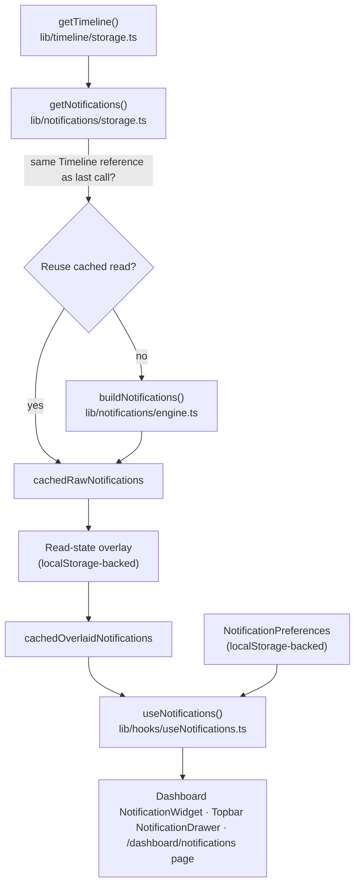

**Notification model**: `NotificationType` is a type alias of
`TimelineEventType` (not a parallel enum, so the two vocabularies can never
drift). Every `Notification` is a direct reshape of one `TimelineEvent` —
`projectId`/`projectName`/`severity` stay `null` for the same 4
aggregate-level types Timeline already leaves `null` for; `link` is carried
over unchanged (never reconstructed, so an aggregate notification can never
produce a broken route); `priority` (`critical`/`high`/`medium`/`low`) and
`icon` are both centralized lookups keyed by type
(`NOTIFICATION_PRIORITY_BY_TYPE`, and `NOTIFICATION_ICON_BY_TYPE` — which
reuses `TIMELINE_EVENT_ICON` from `components/timeline/TimelineEventBadge.tsx`
directly rather than a second icon map).

**Read-state persistence**: `storage.ts` layers a `readOverlay: Map<id,
readAt>` on top of the pure `buildNotifications()` output — the same
overlay-over-content pattern `lib/alerts/service.ts` already uses for its
own per-alert `read`/`pinned` state. The overlay is backed by
`localStorage` (key `base-radar:notification-read-state`, version-guarded
exactly like `lib/watchlist/storage.ts`'s own read/write pair) so read
state survives a refresh; hydration happens lazily, once, the first time
anything actually needs the overlay. `markNotificationRead`,
`markNotificationUnread`, `markAllNotificationsRead`, and
`clearAllReadState` are the four mutations; each persists immediately and
notifies subscribers.

**Preferences**: `NotificationPreferences` is `Record<NotificationType,
boolean>`, defaulting to everything enabled. Backed by `localStorage` (key
`base-radar:notification-preferences`) with the same version-guard/fallback
shape. `filterNotificationsByPreferences` is applied inside
`useNotifications()` itself — muting a type is a UI-layer filter on top of
`getNotifications()`'s output, not a second data source, so every consumer
(Dashboard widget, Topbar drawer, Notification page) automatically respects
it.

**UI components** (`components/notifications/`): `NotificationCenter` (the
page-level orchestrator, `/dashboard/notifications`), `NotificationItem`
(one row — reuses `TimelineEventBadge` directly for the type badge),
`NotificationGroup` (a Today/Yesterday/Earlier date bucket — grouping logic
lives in `components/notifications/grouping.ts`), `NotificationBadge`
(priority chip), `NotificationMetric`, `NotificationEmpty` (the three
distinct empty states — no data / no search results / no filter results),
`NotificationWidget` (compact Dashboard preview — renders only the latest
notification), `NotificationDrawer` (the Topbar bell + dropdown, built on
`@base-ui/react/menu`'s `Menu.Root`/`Menu.Trigger`/`Menu.Popup` — the same
primitive `UserMenu`/`WidgetCard`'s own action menu already use), and
`NotificationPreferencesPage` (`/dashboard/settings/notifications`). Search,
read-state/type filters, and sorting (Newest/Oldest/Highest Priority) live
in `components/notifications/filters.ts` — pure functions operating only on
an already-built `Notification[]`.

**Hooks** (`lib/hooks/`): `useNotifications` (a `useSyncExternalStore`
binding to `getNotifications()`, subscribed to
`lib/alerts/service.ts`/`lib/watchlist/service.ts`/the Notification
storage's own read-state listeners, plus a second independent binding to
`getNotificationPreferences()` — returns `{ notifications, markRead,
markUnread, markAllRead, clearReadState }`), `useNotificationMetrics` (the
5-tile metric list), and `useNotificationPreferences` (the Preferences
page's binding, returning `{ preferences, setEnabled }`).

**Dashboard integration**: `NotificationWidget` renders only the top-level
summary (unread/total counts, the single latest notification) — never the
full grouped feed, which lives at `/dashboard/notifications` only.
`NotificationDrawer` replaces the Topbar's previous plain
`Link`-to-`/dashboard/alerts` bell — a deliberate PR19 Part 2 decision: the
Notification Engine aggregates Alerts/Daily Brief/Portfolio
Intelligence/Timeline into one feed, so one unified bell (matching
GitHub/Linear/Slack's own single-inbox convention) replaces what used to
point at the raw Alert feed. `/dashboard/alerts` itself, and its own
Sidebar nav entry/badge, are untouched.

**Relationship with Timeline, Daily Brief, and Portfolio Intelligence**:
Notifications is the topmost layer in the reuse chain — AI Intelligence
Engine (PR15.3) → Daily Brief (PR16) → Portfolio Intelligence (PR17) →
Intelligence Timeline (PR18) → Notification System (PR19). It reads only
from Timeline (never from Daily Brief, Portfolio Intelligence, the AI
Intelligence Engine, the Alert Engine, or the Provider Layer directly) and
adds no new scoring, narrative, or aggregation logic of its own — its only
real contribution is reshaping already-aggregated events into a
presentation-ready, read-state-aware notification feed.

## Automation System

`lib/automation/` (PR20) evaluates already-built Notifications against
user-defined rules — not a seventh intelligence engine. It consumes
exactly one existing service, `getNotifications()`, and produces
`AutomationResult`s: real matches between a real `Notification` and a
real, enabled `AutomationRule`. It generates no notification, calls no
provider, and never reads Timeline/Portfolio Intelligence/Daily
Brief/the AI Intelligence Engine/the Alert Engine directly.

```
lib/automation/
  types.ts        AutomationRule + AutomationResult models, trigger/condition/action unions
  engine.ts       buildAutomationResults(): the pure pipeline entry point
  rules.ts        matchesRule() (centralized evaluation) + DEFAULT_AUTOMATION_RULES + localStorage-backed enabled overlay
  storage.ts      cachedAutomationResults (pure runtime cache) + getAutomationResults()
  preferences.ts  AutomationPreferences (master enabled switch) + localStorage-backed getters/setters
```

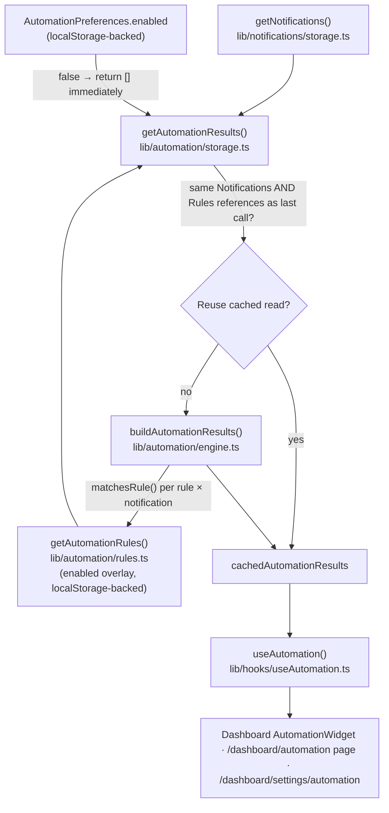

**Automation model**: `AutomationTriggerType` is `NotificationType | "unread-notification" | "high-priority-notification" | "critical-notification"` — the 10 real notification types reused directly, plus 3 meta-triggers that qualify by a notification's own already-computed field rather than its type. `AutomationCondition` is a small closed set (`priority`/`isRead`/`type` equality checks) layered on top of `trigger`, deliberately not a general query DSL. Every `AutomationResult` carries `projectId`/`projectName`/`link` straight from the matched notification (never reconstructed, never fabricated for aggregate-level matches) and a single honest `status: "triggered"` — richer lifecycle states (`queued`/`completed`) are deferred until a real execution layer exists, which this PR explicitly does not build (actions are data only: no email, no push, no webhooks).

**Rule persistence**: `rules.ts` layers an `enabledByRuleId` overlay (a `Map<ruleId, boolean>`) on top of the static `DEFAULT_AUTOMATION_RULES` array — the exact same overlay-over-content pattern `lib/notifications/storage.ts`'s read-state overlay already uses. Rule *logic* (trigger, conditions, actions) is fixed; only `enabled` is ever overridden, so "Do NOT allow editing rule logic" holds structurally, not just by convention. Backed by `localStorage` (key `base-radar:automation-rule-state`, version-guarded exactly like every other overlay in this codebase) so enable/disable state survives a refresh. `setRuleEnabled` and `resetAutomationRules` are the two mutations; `resetAutomationRules` clears the overlay entirely rather than forcing every rule to `true`, so a rule already at its own default just has nothing to revert.

**Preferences**: `AutomationPreferences` is `{ enabled: boolean }` — a single master switch, defaulting to `true`. Backed by `localStorage` (key `base-radar:automation-preferences`) with the same version-guard/fallback shape as every other preferences module. Checked at the very top of `getAutomationResults()`: when `false`, it returns an empty array immediately without evaluating a single rule — a real kill switch, not a UI-level filter, which keeps "never evaluate rules in the UI" true in the strongest sense available.

**UI components** (`components/automation/`): `AutomationCenter` (the page-level orchestrator, `/dashboard/automation`), `AutomationItem` (one row — reuses `NotificationBadge` directly for the priority chip, since `AutomationResult.priority` is the exact same `NotificationPriority` union), `AutomationGroup` (a Today/Yesterday/Earlier date bucket), `AutomationBadge` (exports both `AutomationTriggerBadge` and `AutomationActionBadge`), `AutomationMetric`, `AutomationEmpty` (four distinct empty states — no data / no search results / no filter results / automation disabled), `AutomationWidget` (compact Dashboard preview — renders only the latest result), and `AutomationPreferencesPage` (`/dashboard/settings/automation`). Search and priority/action filters live in `components/automation/filters.ts` — pure functions operating only on an already-built `AutomationResult[]`.

**Hooks** (`lib/hooks/`): `useAutomation` (a `useSyncExternalStore` binding to `getAutomationResults()`, subscribed to `lib/alerts/service.ts`/`lib/watchlist/service.ts`/the Notification storage's read-state listeners/the Automation rule and preference listeners, plus a second independent binding to `getAutomationPreferences()` — returns `{ results, enabled }`), `useAutomationMetrics` (the 5-tile metric list), `useAutomationRules` (the Preferences page's rule-list binding, returning `{ rules, setEnabled, reset }`), and `useAutomationPreferences` (the master-toggle binding, returning `{ preferences, setEnabled }`).

**Dashboard integration**: `AutomationWidget` renders only the top-level summary (triggered/high-priority counts, the single latest result) — never the full grouped feed, which lives at `/dashboard/automation` only. Reached via the Sidebar's "Automation" nav item (under Portfolio, alongside Watchlist/Alerts) and via each notification's own deep link, per the PR brief's own "Dashboard widget, Sidebar, Notification deep links" access pattern — no Topbar icon was added.

**Relationship with the Notification Engine**: Automation is the topmost layer in the reuse chain — AI Intelligence Engine (PR15.3) → Daily Brief (PR16) → Portfolio Intelligence (PR17) → Intelligence Timeline (PR18) → Notification System (PR19) → Automation System (PR20). It reads only from Notifications (never from Timeline, Portfolio Intelligence, Daily Brief, the AI Intelligence Engine, the Alert Engine, or the Provider Layer directly) and adds no new scoring, narrative, or notification-generation logic of its own — its only real contribution is evaluating already-built notifications against user-configurable rules.

## Global Search & Command Palette

`lib/command/` + `lib/search/` (PR21) is a pure UI/navigation layer sitting
above every engine — not an eighth intelligence engine, and it never calls a
provider or recomputes anything. It searches BOTH a static command registry
and existing application data, then routes to an existing page. Nothing
here introduces new business logic; every result is a reshape of a value
some other hook/helper already produced.

```
lib/command/
  commands.ts       COMMANDS registry (11 static destinations) + Command/CommandGroup types
lib/search/
  types.ts          SearchableItem — the one common shape every result normalizes into
  globalSearch.ts   8 normalizers + scoreItem() + globalSearch() + groupSearchResults()
  preferences.ts    SearchPreferences (localStorage-backed) — Recent Searches on/off, max size, history on/off, keyboard shortcut on/off
  storage.ts        Recent Searches list (query strings only, localStorage-backed)
```

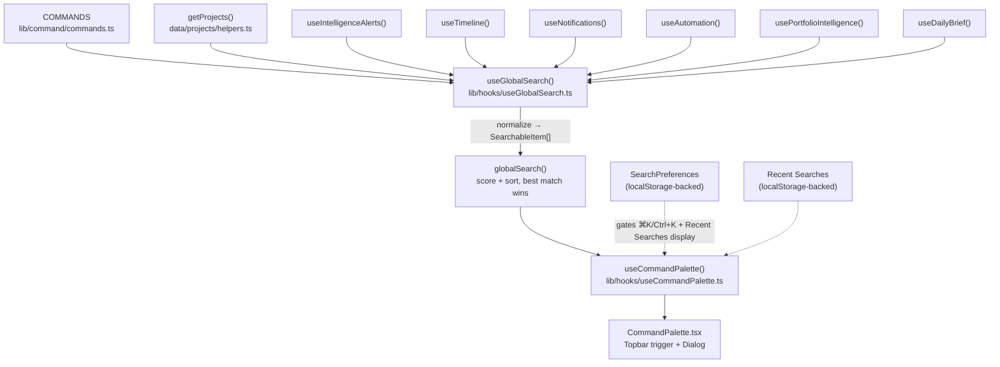

**Search architecture**: every source normalizes into one `SearchableItem`
(`id`/`title`/`description`/`group`/`type`/`icon`/`route`/`keywords`/
`metadata`/`source`). Commands tagged `"Settings"` (Notification/Automation/
Search Preferences) keep their own `Settings` group; every other static
command folds into a generic `Commands` group, so dynamic per-item results —
not static shortcuts — own the `Projects`/`AI Intelligence`/`Timeline`/
`Notifications`/`Automation`/`Portfolio`/`Daily Brief` groups. Routes always
point at a real, existing page: Projects get a genuine per-project deep link
(`/dashboard/projects/{slug}`); AI Intelligence alerts route there too when
the alert's project resolves (falling back to `/dashboard/alerts` otherwise);
Timeline/Notifications/Automation/Portfolio/Daily Brief each route to their
own section's page, never a fabricated per-item URL.

**AI Intelligence as a search source** (PR-010): every layer downstream of
the AI Intelligence Engine (Daily Brief, Portfolio Intelligence, Timeline,
Notifications, Automation) was already searchable — the Engine's own
per-project reads (`IntelligenceAlert`, `lib/alerts/intelligence`) were the
one gap in that reuse chain. `useIntelligenceAlerts()` subscribes to the same
Alert Engine store every other alert surface already reads, so this adds no
new fetch. Project keyword matching (`normalizeProject`) also now includes
`project.chains` alongside `tags`/`categories` — real, static registry data
that wasn't reachable via keyword match before.

**Scoring**: `globalSearch()` uses simple weighted substring/keyword/
description/metadata matching — no fuzzy-match library — and sorts by score
alone (not group-first), so a strongly-matching Project or Notification
outranks a weakly-matching Command. `groupSearchResults()` then partitions
that already-sorted list into sections in first-appearance order, so the
section containing the single best match always renders first and empty
groups never render, without ever reshuffling the underlying rank.

**Preferences & Recent Searches** (PR21 Part 3): `SearchPreferences`
(`enableRecentSearches`, `maxRecentSearches` default 10 clamped to
`[1, 50]`, `enableSearchHistory`, `enableKeyboardShortcut`) is
`localStorage`-backed with the same version-guard/graceful-fallback shape
as every other preferences module in this app. Recent Searches
(`lib/search/storage.ts`) persists only query strings — never search
results, never provider data — newest first, de-duplicated
case-insensitively, capped to `maxRecentSearches`. `recordSearch()` checks
`enableSearchHistory` at the storage layer itself (a real kill switch, same
pattern as Automation's master toggle) and is only ever called after a real
selection was made from a non-empty query, so "only store queries that
produced results" holds by construction. The Command Palette shows a Recent
Searches section only when `enableRecentSearches` is on, history is
non-empty, and the query is empty — it disappears the moment the user types
a character. The `enableKeyboardShortcut` preference is read fresh on every
keypress inside the global ⌘K/Ctrl+K listener: when off, the shortcut is a
no-op, but the Topbar's mouse trigger is completely unaffected.

**UI components** (`components/command/`): `CommandPalette` (the Topbar
trigger + Base UI `Dialog`, focus trap and return-focus-to-trigger provided
for free), `CommandSearch` (the combobox input row), `CommandResults`
(`role="listbox"`, renders `groupSearchResults()`'s output), `CommandGroup`
(one labeled section), `CommandItem` (`role="option"`, one row), and
`CommandEmpty` ("No results found." / "Try another keyword."). The Settings
page (`components/search/SearchPreferencesPage.tsx`,
`/dashboard/settings/search`) reuses the same card/section chrome as
Notification/Automation preferences.

**Hooks** (`lib/hooks/`): `useGlobalSearch` (aggregates + scores, no routing,
no provider access), `useCommandPalette` (open/close/toggle/selection/query
state, the global keyboard listener, and — as of Part 3 — `recentSearches`/
`showRecentSearches`/`recordSearch`/`selectRecentSearch`), and
`useSearchPreferences` (load/save/reset only — performs no searching
itself).

**Relationship with every engine below it**: Global Search reads AI
Intelligence, Timeline, Notifications, Automation, Portfolio Intelligence,
and Daily Brief each through their own existing hook — never a provider,
never an engine recomputation, never a new scoring or narrative rule. It is
the one layer in this app whose entire job is aggregation and presentation
of what every other layer already computed.

## Personalization & Advanced Watchlists

`lib/personalization/` (PR22) sits above every engine and above Global
Search — a client-side organization layer, never a ninth intelligence
engine. It never calls a provider, and its filtering never recomputes a
score, narrative, or any other engine output; it only narrows list-shaped
data an engine already produced, matching by project id.

```
lib/personalization/
  types.ts          PersonalWatchlist, PersonalizationState, icon/color unions
  storage.ts         CRUD store (create/rename/delete/duplicate/reorder/pin/
                      setActive/addProject/removeProject/importWatchlists),
                      localStorage-backed, version-guarded
  preferences.ts      PersonalizationPreferences (localStorage-backed) —
                      Dashboard filtering, Search prioritization, remember
                      active watchlist, show Topbar selector — each on by
                      default
  filter.ts           6 pure filter functions, one per consumer (Timeline,
                      Notifications, Automation, Portfolio, Daily Brief,
                      AI Intelligence alerts)
  importExport.ts     exportWatchlistsToJson + validateWatchlistImport —
                      pure, no storage writes; the caller applies a
                      validated result via storage.ts only after user
                      confirmation
```

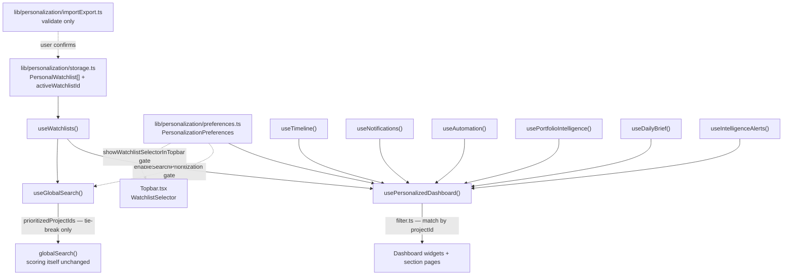

**Watchlist model**: a `PersonalWatchlist` is `{ id, name, description, icon,
color, projectIds: string[], pinned, createdAt, updatedAt }` — project
membership is ids only, never a duplicated `Project` record. This is a
distinct concept from `lib/watchlist/`'s single flat list, which remains
the source of truth every intelligence engine's own scoping is built on;
Personalization never touches or reads that store. Default watchlists
(Favorites, AI, DeFi, Infrastructure, Gaming, Stablecoins) are created
empty on first launch and are fully editable/deletable like any other.

**Dashboard filtering** (`lib/personalization/filter.ts` +
`lib/hooks/usePersonalizedDashboard.ts`): each filter function builds one
`Set(watchlist.projectIds)` and runs one `.filter()` — O(n), no provider
call, no engine recomputation. `TimelineEvent`/`Notification`/
`AutomationResult` have a nullable `projectId`; items with `projectId ===
null` (narrative rollups, recommendations, portfolio/brief summaries)
always pass through, since a watchlist can't exclude content that isn't
about any single project. `PortfolioIntelligence`/`DailyBrief`'s five
project-referencing list fields are filtered while every scalar field
(`projectCount`, `averageScore`, `overallHealth`, etc.) is spread through
unchanged — recomputing an aggregate for a filtered subset would mean
re-deriving engine logic, which this layer never does.
`IntelligenceAlert.projectId` is a plain, non-nullable `string`, so its
filter has no passthrough case. `usePersonalizedDashboard()` is the single
hook every widget and section page reads: it exposes `isPersonalized`
(true only when `filterDashboardByActiveWatchlist` is on **and** a
watchlist is active) plus both the raw engine output (aggregate metric
tiles) and the filtered, list-shaped data components actually render.

**Search prioritization**: `globalSearch()` accepts an optional
`prioritizedProjectIds` set used only as a tie-break — when two results
score identically, a Project in the active watchlist sorts first, but a
strongly-matching non-project result still outranks a weakly-matching
watchlist project. `useGlobalSearch()` passes the active watchlist's
`projectIds` through only when `enableSearchPrioritization` is on;
otherwise `globalSearch()` behaves exactly as it did before Personalization
existed. No result is ever hidden, and scoring itself is never modified.

**Explorer prioritization** (PR-011): `components/explorer/sort.ts`'s
`sortProjects()` accepts the same kind of optional `prioritizedProjectIds`
set, applying the identical tie-break rule Global Search already
established — only when two projects already sort identically on the
active field (e.g. both have no TVL, or an identical Health score) does
watchlist membership decide their order; it never overrides a real
TVL/Health/Confidence/GitHub-stars difference. `ExplorerPageClient` passes
the active watchlist's `projectIds` unconditionally (no separate
preference gate — the effect is purely a tie-break, never a filter or a
hide, so there's nothing for a kill switch to protect against). This is
the same prioritization concept applied to a second surface, not a second
system.

**Preferences** (`lib/personalization/preferences.ts`,
`/dashboard/settings/personalization`): `filterDashboardByActiveWatchlist`,
`enableSearchPrioritization`, `rememberActiveWatchlist`,
`showWatchlistSelectorInTopbar` — each a kill switch over an
already-built feature, the same shape Automation's master preference
established, all defaulting to on. Recovery is field-by-field rather than
all-or-nothing: a persisted object missing the newer fields (an older
version) or with one corrupted field still recovers everything it can
validate, defaulting only what's missing or invalid — never discarding the
whole record over one bad field. `rememberActiveWatchlist` is read once,
at `lib/personalization/storage.ts`'s module-level state initialization
(once per session/reload): when off, that session starts with no active
watchlist rather than restoring the last one, without touching the
persisted value on disk and without affecting any mutation for the rest of
that session — picking a new active watchlist still works normally
afterward.

**Import/Export** (`lib/personalization/importExport.ts`): export
serializes the current watchlists into a versioned, pretty-printed JSON
envelope, downloaded as a file via a `Blob` + anchor-element download —
nothing leaves the browser. Import is a two-step, confirmation-gated flow:
`validateWatchlistImport()` only parses and sanitizes a raw file — it never
writes to storage. It rejects the whole file only when it isn't JSON,
doesn't match the export envelope, or recovers zero usable watchlists;
every other problem (an invalid icon/color, a project id no longer in the
registry, a corrupted date, a duplicate name within the file) is recovered
field-by-field with a reported reason. The settings page shows the user
exactly what was found before calling `storage.ts`'s `importWatchlists()`,
which is purely additive: every imported entry gets a fresh id (never
trusting one from the file) and a name suffixed " (Imported)" if it
collides with an existing watchlist — nothing already in storage is ever
overwritten or removed.

**Hooks** (`lib/hooks/`): `useWatchlists` (CRUD + `activeWatchlist`/
`activeWatchlistId` + `importWatchlists`, no provider access),
`usePersonalizedDashboard` (composes `useWatchlists` with all six engine
hooks and `filter.ts`), `usePersonalizationPreferences` (load/save/reset
only, performs no filtering itself).

**UI components** (`components/watchlists/`, `components/personalization/`):
`WatchlistsWorkspace`/`WatchlistSidebar`/`WatchlistCard`/`WatchlistEditor`/
`WatchlistEmpty` (the `/dashboard/watchlists` management surface),
`WatchlistSelector` (reused in both the Topbar and the Watchlists page —
`@base-ui/react/menu`, same primitive `UserMenu.tsx` established), and
`PersonalizationPreferencesPage` (`/dashboard/settings/personalization`,
same card/section chrome as every other settings page).

**Relationship with every engine below it**: Personalization reads
Timeline, Notifications, Automation, Portfolio Intelligence, Daily Brief,
and AI Intelligence alerts each through their own existing hook — never a
provider, never an engine recomputation, never a new scoring or narrative
rule. Like Global Search, its entire job is presentation-layer scoping of
what every other layer already computed.

## Account Layer

`lib/account/` (PR23 Part 1) sits directly above Personalization and below
the Dashboard — a local-only account/profile foundation, never an
authentication provider. It has no backend, no OAuth, no API calls, and no
network request anywhere in it; every read and write is `localStorage`.
Nothing in Personalization, Global Search, or any of the eight intelligence
engines depends on it — the whole app works identically whether the current
account is the default Guest or a locally-renamed profile.

```
lib/account/
  types.ts       Account, ProfileInput, ProfileValidationError
  storage.ts      the only file touching localStorage — buildGuestAccount(),
                   sanitizeAccount() (field-by-field recovery), readAccount(),
                   writeAccount(); versioned, SSR-safe, try/catch
  migration.ts    versioned upgrade runner (PR23 Part 3) — honestly empty
                   migration list today (there has only ever been one
                   Account schema version), wired into storage.ts's
                   readAccount() as a real, active no-op pass-through
  validation.ts    diagnostic validation (PR23 Part 3) — validateAccountRecord()
                   reports (rather than silently recovers) missing fields,
                   corrupted timestamps, and invalid types; validateAccountImport()
                   is the future-ready "Import Account" validator, unwired to
                   any UI yet
  service.ts      framework-agnostic public API — cached singleton + listeners,
                   getAccount(), validateProfileInput(), updateAccount(),
                   createAccount(), signOut(), deleteAccount(), exportAccount(),
                   validateAccountImport(), subscribe()
```

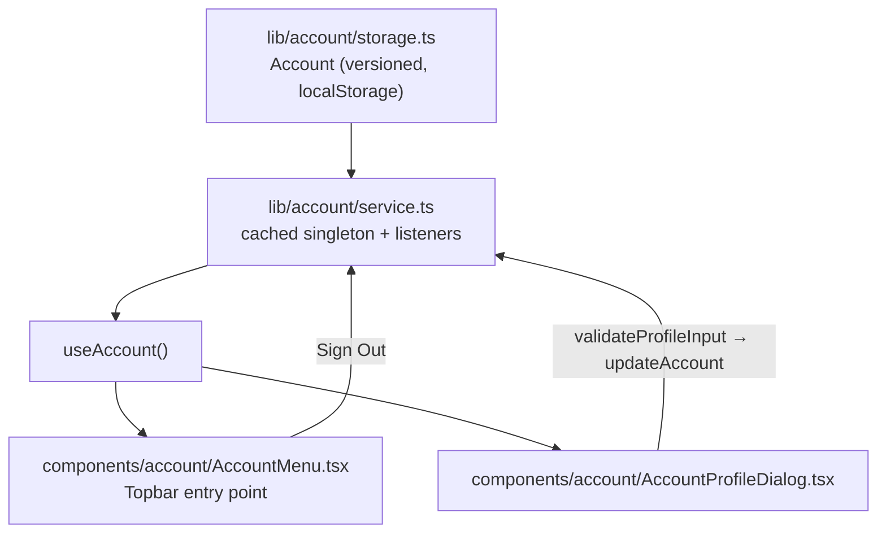

**Account model**: `{ id, name, username, email, avatar, createdAt,
updatedAt, lastActiveAt, isGuest }`. On first launch, `storage.ts` creates a
"Guest User" default account (`isGuest: true`) — every other layer of the
app continues functioning exactly as it did before this PR, since nothing
gates behavior on whether an account is a guest.

**Storage** (`lib/account/storage.ts`, key `base-radar:account`, version
1): the same field-by-field recovery Personalization's preferences
established — `sanitizeAccount()` starts from a fallback (a fresh Guest)
and overwrites only the fields that individually validate on the persisted
blob, so a record from an older schema version or with one corrupted field
still recovers everything else rather than the whole record being
discarded. Never touches Personalization's, the flat Watchlist's, or any
other layer's storage key — `signOut()` and `deleteAccount()` only ever
replace the account record itself.

**Profile editing** (`components/account/AccountProfileDialog.tsx`):
Display Name, Username, Avatar URL, and an optional Email, validated by
`lib/account/service.ts`'s `validateProfileInput()` — empty name, empty or
malformed username, invalid email format, and a duplicate-username check
that is real but currently always-false (there is only ever one local
account per browser today; `isDuplicateUsername()` compares against an
empty `knownAccounts` array as a genuine hook point for a future
multi-account backend, not a stubbed-out placeholder). The dialog's
`<form>` sets `noValidate` so this app's own validation messages are always
what the user sees, never the browser's native constraint-validation UI.

**Foundation seams for a future backend**: `createAccount()`, `updateAccount()`,
`deleteAccount()`, and `exportAccount()` are already `async` and already
shaped the way a real network-backed implementation would need — a future
PR can replace `storage.ts`'s local reads/writes with real API calls
without changing `service.ts`'s public signatures or any consumer, the same
forward-looking shape `lib/watchlist/service.ts` established. The
Topbar's Cloud Sync menu item is a disabled placeholder with a "Soon"
badge and an explanatory tooltip — there is no cloud sync, no sync engine,
and no server in this PR.

**Hooks** (`lib/hooks/useAccount.ts`): `useSyncExternalStore`-backed,
returns `{ account, isGuest, updateProfile, validateProfile, signOut,
exportAccount }`. No provider access, no polling.

**UI components** (`components/account/`): `AccountMenu` (replaces the
previous placeholder `UserMenu` in the Topbar — Profile, Preferences,
Personalization, a disabled Cloud Sync item, and Sign Out, which returns to
a **fresh** Guest account, never reusing the signed-out account's id),
`AccountAvatar` (image or initials fallback, shared by the menu trigger and
the profile dialog), `AccountProfileDialog` (the same outer/inner
remount-on-`open` dialog pattern `WatchlistEditor.tsx` established, so
every field initializes from the current account with no effect resetting
state on prop change).

**Migration & validation** (PR23 Part 3): `migration.ts` is the single
source of truth for `base-radar:account`'s current schema version
(`storage.ts` imports it rather than redefining the number) and runs
`readAccount()`'s parsed blob through `migrateAccountRecord()` before
`sanitizeAccount()` ever sees it — honestly a no-op today, since
`ACCOUNT_MIGRATIONS` is empty, but a real, active call site ready for a
future schema break. `validation.ts` is a separate, *reporting* concern
from `sanitizeAccount()`'s silent recovery: `validateAccountRecord()`
returns every structural issue found (missing id/name/username, invalid
email/avatar type, corrupted timestamps, wrong `isGuest` type) instead of
quietly defaulting them, which is what powers the Sync Layer's Diagnostics
dialog reporting on Account storage health.

## Sync Adapter Layer

`lib/sync/adapters/` sits between Account and the Sync Queue in the
pipeline — the Sync Queue and Sync Engine only ever handle a generic
`SyncOperation`; they never import `Account`, `PersonalWatchlist`, or
`PersonalizationPreferences` directly. Each entity owns its own adapter,
conforming to one shared contract:

```
lib/sync/adapters/
  account.ts       accountSyncAdapter — Account ↔ SyncOperation
  watchlists.ts     watchlistSyncAdapter — PersonalWatchlist ↔ SyncOperation
  preferences.ts    preferencesSyncAdapter — PersonalizationPreferences ↔
                     SyncOperation (a singleton entity — no per-record id,
                     so every operation addresses the fixed
                     PREFERENCES_ENTITY_ID constant)
```

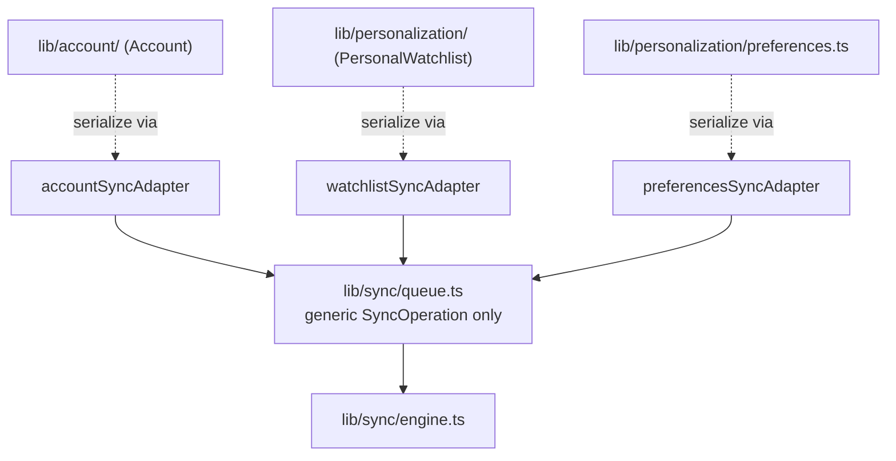

Each adapter implements `SyncAdapter<TData>` (`lib/sync/types.ts`):
`version()` (the adapter's own payload-schema version, distinct from any
per-record `updatedAt`), `validate()` (a type guard), `serialize()`/
`deserialize()` (JSON in/out of `SyncOperation.payload`, opaque to the
queue), `createOperation()` (the *only* place a `SyncOperation` gets
built — via `lib/sync/queue.ts`'s `buildOperation()`), and `merge()` (a
real, honest strategy — last-write-wins by `updatedAt` for Account and
Watchlist; remote-wins-by-convention for Preferences, which carries no
per-record timestamp to compare). Every `merge()` is genuinely callable
but never called automatically today: there is no remote version of any
entity to merge against without a backend.

## Sync Layer

`lib/sync/` (PR23 Part 2) sits directly above Account and below the
Dashboard — an offline-first synchronization foundation, not a real cloud
sync. It has no backend, no OAuth, no API, and no network request anywhere
in it; every read/write is `localStorage`, and the only "network"
awareness it has is the browser's own `navigator.onLine` + `online`/
`offline` events, never a request of its own. Account, Personalization,
Watchlists, and Global Search are all untouched by this layer and never
import from it — synchronization is a deliberately separate concern.

```
lib/sync/
  types.ts        SyncOperation, ConflictRecord, SyncState, SyncStatus,
                   SyncAdapter<TData>
  queue.ts         the only file touching localStorage for the operation
                    queue — raw read/write + buildOperation()
  operations.ts    queue semantics on top of queue.ts — enqueue, dequeue,
                    peek, clear, retry
  conflicts.ts      the only file touching localStorage for conflict
                    records — read/write + addConflict()/resolveConflict()
  status.ts         persisted lastSyncAt + navigator.onLine detection +
                    deriveState() (the one place priority among offline/
                    conflict/syncing/error/success/pending/idle is decided)
  migration.ts      versioned upgrade runner for all three storage keys
                    (PR23 Part 3) — the single source of truth for each
                    key's current version, imported by queue.ts/status.ts/
                    conflicts.ts rather than redefined; every migration
                    list is honestly empty today, wired in as a real,
                    active (if currently no-op) pass-through
  validation.ts     diagnostic validation (PR23 Part 3) — validateQueueRecords()/
                    validateConflictRecords() report duplicate ids, corrupted
                    timestamps, unknown operation/entity types, and broken
                    references against each key's *raw* (pre-sanitize) value,
                    distinct from queue.ts/conflicts.ts's own silent
                    filter-and-drop recovery
  diagnostics.ts    read-only aggregator (PR23 Part 3) — combines queue,
                    conflict, status, migration, and validation state
                    (plus lib/account/validation.ts's Account check) into
                    one memoized SyncDiagnostics snapshot; introduces no
                    new sync logic
  engine.ts         runSyncAttempt() decides one attempt's honest outcome
                    by delegating to whichever connector is currently
                    active (see "Connector Layer" below) — never touches
                    storage or a network client itself
  service.ts        the public API — combines every file above into one
                    cached snapshot + listeners, exposes performSync()/
                    retrySync()/enqueueOperation()/resolveConflict()/
                    exportQueue()/subscribe()
  adapters/         see "Sync Adapter Layer" above
  connectors/       see "Connector Layer" below
```

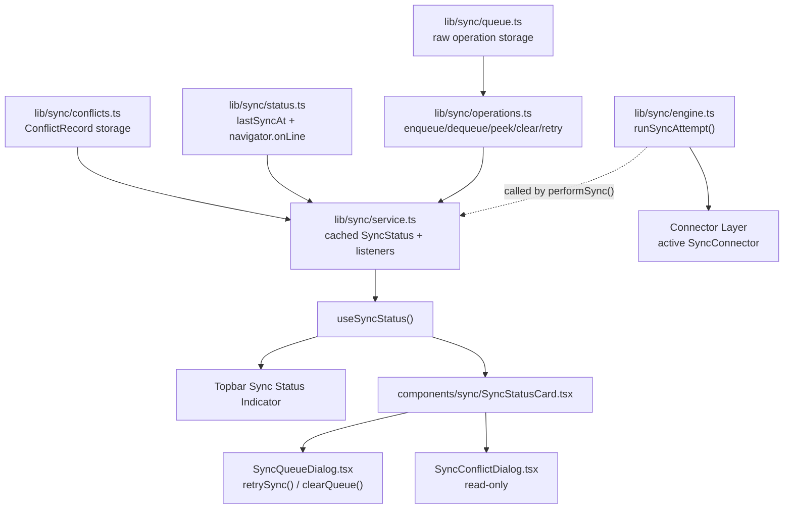

**Sync model**: `SyncOperation = { id, type, entity, entityId, createdAt,
updatedAt, status, retryCount }`. `entity` is one of the three entities
this PR only *prepares contracts* for — `"watchlist" | "preferences" |
"account"` — nothing in this codebase actually enqueues a real operation
for any of them yet; that wiring is explicitly out of scope for this PR.
`ConflictRecord = { entity, entityId, localVersion, remoteVersion,
resolved }` — a real, working store with no automatic producer, since
detecting a genuine conflict requires a remote version to compare against,
which doesn't exist without a backend.

**Status derivation** (`lib/sync/status.ts`'s `deriveState()`): priority
order is offline (nothing can be attempted while offline) → conflict
(needs attention) → the current attempt's own in-flight/just-finished
phase (syncing/error/success) → the plain queue-derived pending/idle
split. `"syncing"`, `"error"`, and `"success"` only ever occur as the
direct, honest outcome of a real `performSync()` call — never fabricated
ahead of time.

**The engine's honesty** (`lib/sync/engine.ts`): `runSyncAttempt()`
delegates the actual push to whichever connector is active in the
Connector Layer (today, always `LocalConnector` — there is still no real
backend registered). It can never report a fabricated success for work
actually sent anywhere: an attempt against an empty queue honestly
resolves `"success"` (there was nothing to fail at); an attempt against
any pending operation honestly resolves `"error"`, with every operation's
retry count bumped — an honest record that an attempt was made and could
not complete without a real backend, never a silent, fabricated success or
a queue quietly cleared as if it had synced.

**Offline detection** (`lib/sync/status.ts` + `service.ts`): real
`navigator.onLine` plus `window.addEventListener("online"/"offline")` —
no polling, no retry loop. A transition only recomputes the snapshot;
nothing here ever attempts a sync automatically in response to coming back
online.

**Hooks** (`lib/hooks/useSyncStatus.ts`): `useSyncExternalStore`-backed,
returns `{ syncStatus, lastSyncAt, pendingOperations, isOffline,
hasConflicts, conflicts, retrySync, clearQueue }` — `conflicts` is a
small, pragmatic addition beyond this PR's brief so `SyncConflictDialog`
has real data to render, not just a boolean.

**Migration** (`lib/sync/migration.ts`): one shared `runMigrations()`
runner backs all three exported functions (`migrateQueueRecord`,
`migrateStatusRecord`, `migrateConflictsRecord`), each wired into its
storage file's read path *before* that file's own field-by-field
sanitize step — so a future schema break gets a real upgrade path, while
today's empty migration lists mean every call is an honest, verified
no-op pass-through.

**Validation & diagnostics** (`lib/sync/validation.ts`,
`lib/sync/diagnostics.ts`, PR23 Part 3): `validation.ts` operates on each
key's *raw*, pre-sanitize parsed value — the same data `queue.ts`/
`conflicts.ts` would otherwise silently filter and drop — and reports
every issue found (duplicate ids, corrupted `createdAt`/`updatedAt`,
unknown operation/entity types, missing `entityId`, a bad `resolved`
flag), rather than a bare "everything's fine." `diagnostics.ts` combines
this with the live, sanitized queue/conflict/status state and Account's
own `validateAccountRecord()` into one `SyncDiagnostics` snapshot: queue
size, pending-operation count (operations whose own `status` is still
`"pending"` — distinct from queue size, since a failed sync attempt
leaves operations in the queue with `status: "error"`), conflict count,
offline state, last sync, per-key storage health (version, whether it's
recognized, valid/total record counts, issue count), and migration
status. It is memoized and only recomputes in response to a real
mutation notification from `lib/sync/service.ts` or
`lib/account/service.ts` — never polled, never recomputed on every
render, and only while `useSyncDiagnostics()` (`lib/hooks/
useSyncDiagnostics.ts`) actually has a subscriber.

**UI components** (`components/sync/`): `SyncStatusCard` (the read-only
summary — current status, queue size, last sync, offline state, conflict
count, storage health, and migration status — opened from both the
Topbar's Sync Status Indicator and the Account Menu's Cloud Sync item;
"View Queue"/"View Conflicts"/"Diagnostics" navigate to the three
actionable/detail dialogs rather than mutating anything itself),
`SyncQueueDialog` (lists every queued operation; the only two actions are
the hook's own `retrySync()`/`clearQueue()`, never a per-row action the
service layer doesn't expose), `SyncConflictDialog` (read-only — conflict
*resolution* isn't built yet, so this only ever lists records, always
empty in practice today, with an honest empty-state explanation rather
than a bare "no data" placeholder), `SyncDiagnosticsDialog` (read-only
report of `useSyncDiagnostics()`'s full snapshot, including a per-key
Storage Health list).

Each of `SyncStatusCard`'s three navigation buttons closes its own dialog
before opening the next one, rather than stacking a second `Dialog.Root`
on top of it — two independent `Dialog.Root` siblings both being "open"
simultaneously let a single Escape press close the wrong (outer) one and
orphan the inner dialog, discovered live during this PR's accessibility
verification. Keeping exactly one dialog open at a time keeps
Escape/focus-trap/focus-restoration behavior correct for all four
dialogs.

## Connector Layer

`lib/sync/connectors/` is an architecture-only addition (a recommendation
made ahead of PR24) sitting between the Sync Engine and any real backend.
Its entire purpose is to keep the Sync Engine ignorant of *how* data ever
actually reaches a backend — the engine only ever calls a generic
`SyncConnector`, never `localStorage`, Supabase, Firebase, Clerk, Auth0, a
REST client, a GraphQL client, or a WebSocket client directly:

```
lib/sync/connectors/
  base.ts        the SyncConnector contract — types only, no
                  implementation: connect()/disconnect()/health()/push()/
                  pull()/authenticate()/signOut()/supportsRealtime()/
                  supportsOffline()/supportsConflictResolution()
  local.ts        LocalConnector — today's production connector, and the
                  registry's default. Uses only navigator.onLine (via
                  lib/sync/status.ts); never a network request. push()
                  preserves the exact honest outcome the engine had before
                  this layer existed: an empty batch trivially succeeds,
                  a non-empty one honestly errors with retry counts
                  bumped, since there is still no real remote to converge
                  with — only this device's own local storage.
  mock.ts         createMockConnector() — a configurable in-memory
                  connector simulating success, failure, offline,
                  conflict, and artificial delay, for future automated
                  testing of the Sync Engine. Never registered as the
                  active connector in production.
  registry.ts      register()/unregister()/get()/setActive()/
                  activeConnector() — the only thing the Sync Engine
                  imports from this directory. Defaults to LocalConnector.
```

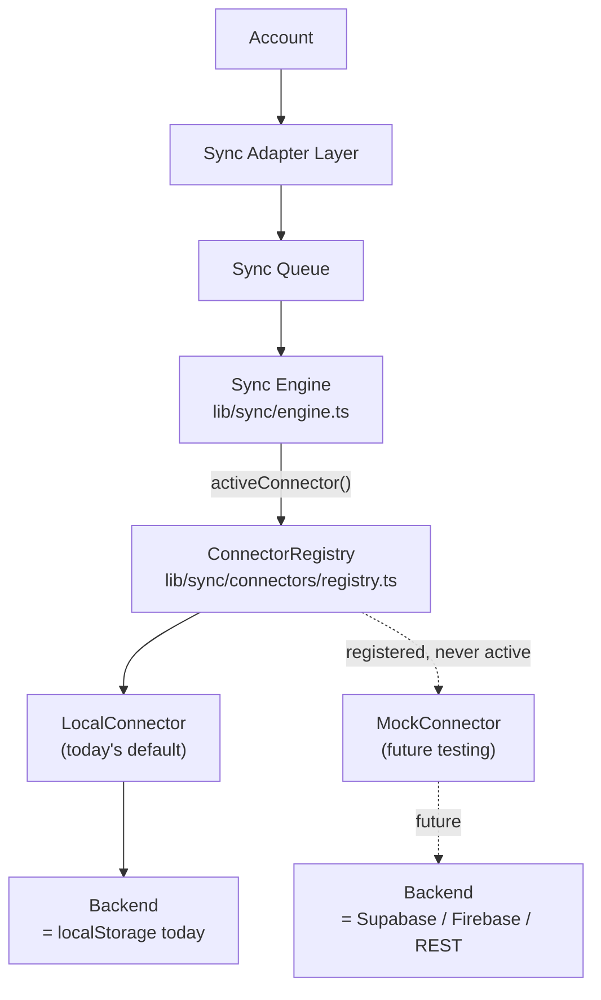

Swapping the real backend in a future PR means implementing `SyncConnector`
once more (e.g. a `SupabaseConnector`) and calling
`register()`/`setActive()` — the Sync Engine, Sync Queue, Sync Adapters,
and every UI component in `components/sync/` stay completely unchanged.
This PR implements no such connector: no authentication, no OAuth, no
Supabase, no Firebase, no REST, no GraphQL, no WebSockets, and no real
cloud synchronization — `LocalConnector` remains the only registered,
active connector, and its behavior is observably identical to the Sync
Engine's pre-Connector-Layer logic.

## Backend Service Layer

`lib/backend/` is another architecture-only addition (a recommendation
made ahead of PR24, one layer further down the pipeline than the
Connector Layer) so that no part of the application ever needs to import
Supabase, Firebase, a REST client, or a GraphQL client directly — every
capability a real backend would need to provide is expressed as one of
four narrow service contracts instead:

```
lib/backend/
  types.ts          shared aggregate types — BackendServices (the four
                     services below) and Backend (id, label, services)
  services/
    account.ts       AccountService — types only, no implementation:
                      getAccount()/updateAccount()/deleteAccount()
    sync.ts          SyncService — types only: push()/pull()/
                      getStatus()/getConflicts()
    storage.ts       StorageService — types only: read()/write()/
                      remove() — the lowest-level generic key/value
                      contract every other service could be built on
    health.ts        HealthService — types only: check()
  local.ts           localBackend — today's only concrete Backend,
                     the registry's default
  registry.ts        register()/unregister()/get()/setActive()/
                     activeBackend()
```

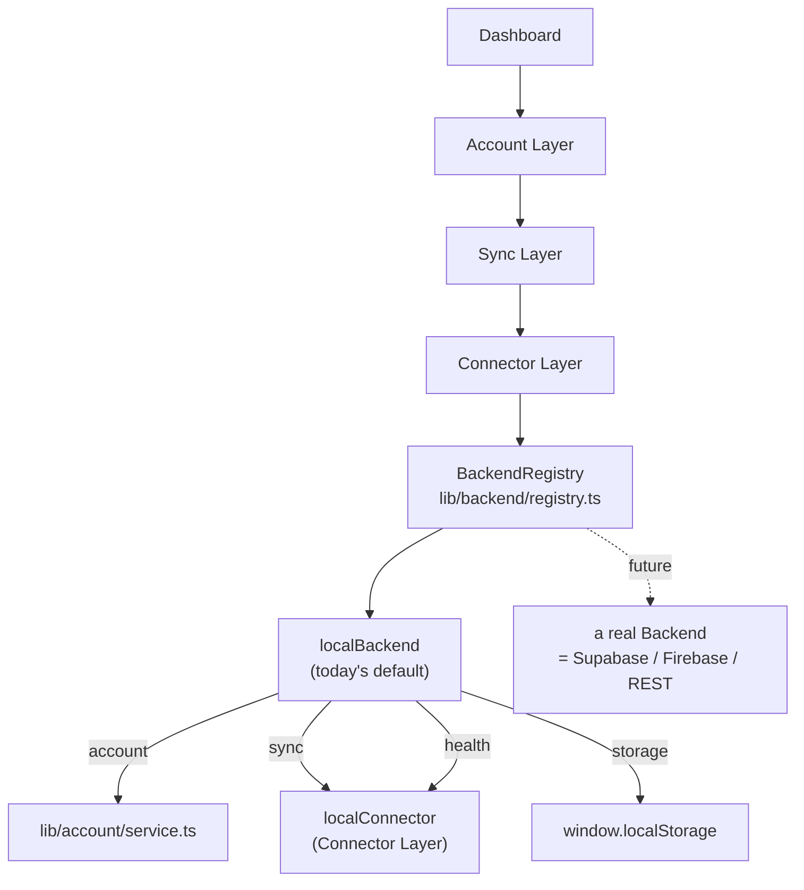

`localBackend` wires all four service contracts to what already exists —
no new logic, only new seams: `account` forwards to
`lib/account/service.ts`'s existing `getAccount()`/`updateAccount()`/
`deleteAccount()`; `sync` forwards `push()`/`pull()` to the Connector
Layer's `localConnector` and `getStatus()`/`getConflicts()` to
`lib/sync/service.ts`'s own cached snapshot; `storage` is the one
genuinely new (but minimal, SSR-safe, best-effort) piece — a thin
`window.localStorage` wrapper, since no existing generic key/value seam
was there to reuse; `health` forwards to `localConnector.health()`.

Nothing in the app calls `activeBackend()` yet — this PR is architecture
only. A future PR could route the Connector Layer (or a future real
connector) through the active backend's services instead of importing
Account/Sync/Connector code directly, at which point registering a real
backend (Supabase, Firebase, a plain REST API) and calling
`setActive()` would be the only change needed anywhere in this pipeline.
This PR implements no such backend: no authentication, no OAuth, no
Supabase, no Firebase, no REST, no GraphQL, no WebSockets, no cloud sync,
and no backend logic beyond wiring `localBackend` to code that already
runs today.

## Theming

Theming is handled by `next-themes` at the root layout, using the standard
`class`-based strategy: a `dark` class is toggled on `<html>`, and Tailwind's
`dark:` variant reacts to it everywhere.

Color values themselves are defined once, as CSS custom properties in
`app/globals.css`, under a Tailwind v4 `@theme` block — a `radar-*` palette
(background, surface, card, primary, accent, success/warning/danger, muted,
plus explicit `radar-light-*` counterparts) sitting alongside the
shadcn-derived base tokens (`--color-primary`, `--color-card`, etc.) that
`components/ui/button.tsx` and other shadcn-derived primitives rely on.
Components reference semantic token names (`bg-radar-bg`,
`text-radar-light-text`) rather than raw hex values, so the light and dark
palettes can evolve independently of component code. `ThemeToggle` reads and
writes the active theme; a `useSyncExternalStore`-based mount check avoids
hydration mismatches between the server's default render and the client's
resolved theme.

## Routing

Routing is Next.js App Router, file-based, with exactly two route trees
today:

```
/              → app/page.tsx            Landing page
/dashboard     → app/dashboard/page.tsx  Dashboard (wrapped by app/dashboard/layout.tsx)
```

`app/layout.tsx` is the root layout for the whole app (fonts, `ThemeProvider`).
`app/dashboard/layout.tsx` is a nested layout scoped to `/dashboard`: it
fetches the live ticker once per request and wraps every dashboard page in
`DashboardLayout`, so any future page added under `app/dashboard/*` (e.g. a
Projects Explorer) automatically inherits the sidebar, topbar, and status
bar without repeating that wiring.

**Error and 404 boundaries** (PR-014): `app/not-found.tsx` is the
application-wide 404, rendered for any unmatched route and for any explicit
`notFound()` call not caught by a more specific `not-found.tsx`.
`app/dashboard/error.tsx` (via the shared `components/dashboard/RouteError`)
is the error boundary Next.js resolves for every `/dashboard/*` route that
doesn't define its own — every dashboard page except `/dashboard/projects/[slug]`,
which keeps its existing, more specific `error.tsx`. Neither existed before
PR-014, so an unhandled render error on, say, `/dashboard/automation` had no
boundary above the root and would have blanked the page.

## Future Expansion

The architecture is deliberately shaped so the following can be added
without restructuring what already exists:

- **New dashboard pages** (Projects Explorer, AI Research Center, Signals &
  Alerts) — each is just a new folder under `app/dashboard/`, inheriting the
  shell for free via the nested layout.
- **Joining the Project Registry to live data** — registry entries already
  carry the provider identifiers needed; this becomes a new aggregator
  function that reads from both `data/projects` and `lib/data/providers`,
  with no change to either.
- **New providers** (e.g. a paid whale-transfer or wallet-balance API) —
  added as a new module in `lib/data/providers/`, wired into `aggregate.ts`,
  invisible to every widget.
- **A general aggregator/service layer** beyond today's per-widget
  functions — `aggregate.ts` is already the single seam where this would
  grow, so widgets remain unaffected.
- **Wallet connect** — would introduce a new, genuinely client-side data
  source (the connected wallet) that the Portfolio and Watchlist widgets are
  already shaped to accept in place of their current mock data.

## Future Intelligence Engine

> **Note**: a first, narrower "AI Intelligence" layer has since shipped,
> scoped specifically to the Alert Engine — see
> [Alert Engine & AI Intelligence](#alert-engine--ai-intelligence) above.
> It reads only `lib/alerts/`'s own alert feed, not the wider Providers
> Layer/Project Registry join this section describes; the general,
> cross-cutting synthesis engine outlined below is still unbuilt.

[docs/ROADMAP.md](ROADMAP.md) names an "Intelligence Engine" milestone
sitting between the current per-widget Services Layer and the future
Projects Explorer/Research pillars described in
[PRODUCT_VISION.md](PRODUCT_VISION.md#product-pillars). This section
describes, at a planning level, what that would extend rather than
replace.

Today, `getIntelligenceBrief()` in `lib/data/aggregate.ts` is the closest
thing to an "intelligence" function in the codebase: it composes four other
aggregator results (`getKpis`, `getMarketOverview`, `getWelcomeStats`,
`getSignals`) into a handful of human-readable points. It is a fixed,
hand-written composition — not a general engine.

A future Intelligence Engine would generalize that composition step into
its own layer:

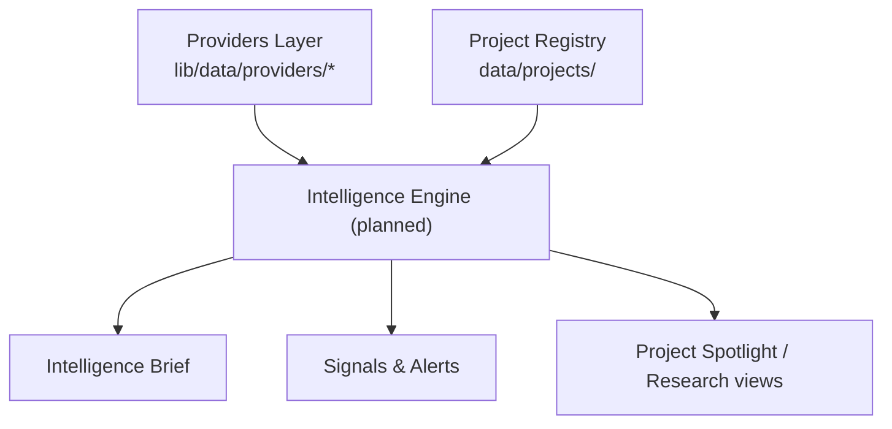

Planning notes (not implemented, no timeline):

- It would sit **above** the Services Layer, not replace it — individual
  aggregator functions would remain the source of truth for a single
  widget's data; the engine's job would be cross-cutting synthesis (e.g.
  "this project's TVL growth plus its GitHub activity plus its narrative
  category together suggest X").
- It is the natural home for the "narrative/category classification"
  gap already called out in [docs/API.md](API.md#future-provider-interfaces)
  — today `getTrendingNarratives()` and `getNarrativeHeatmap()` return
  curated mock data specifically because no such classification exists yet.
- It would be the first consumer that reads **both** the Project Registry
  and the live Providers Layer in the same function, using the
  `providerIds` already defined on every `Project` — the join point
  [docs/ARCHITECTURE.md](#project-registry) already anticipates.
- Signals & Alerts (see [docs/ROADMAP.md](ROADMAP.md)) would likely be
  built as a consumer of this engine rather than a standalone
  DexScreener-only function like today's `getSignals()`.
