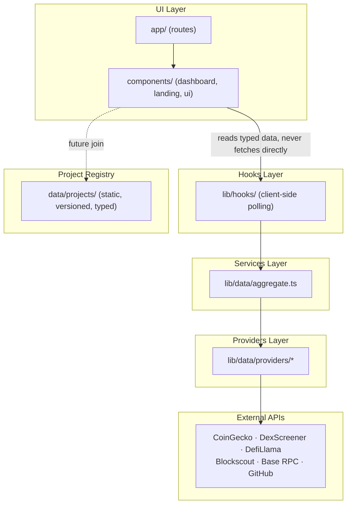
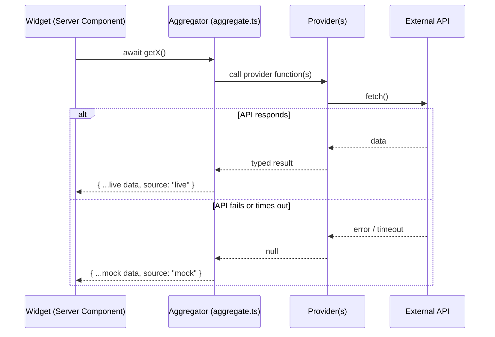
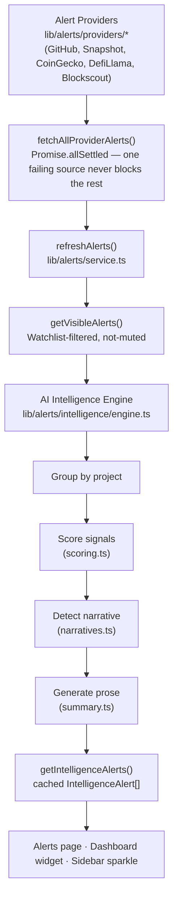
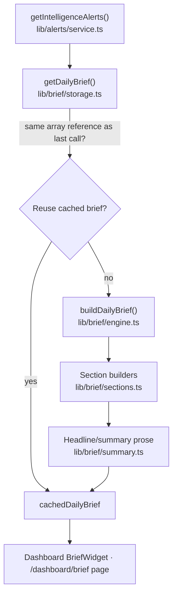
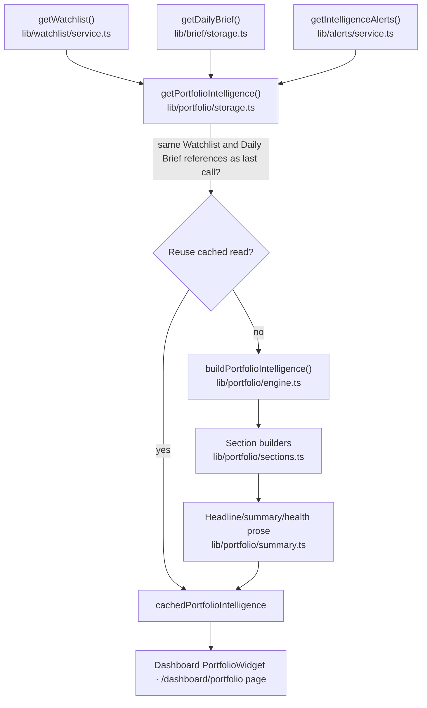
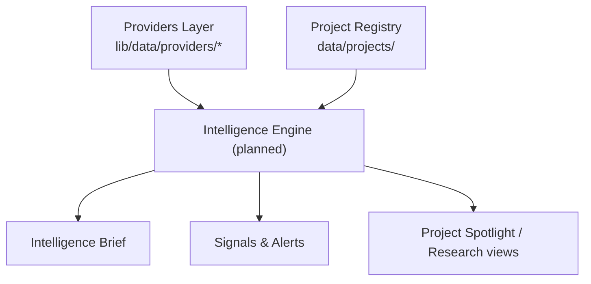

# Architecture

This document explains how Base Radar is put together as a system: the
layers it's built from, how data moves through it, and how the major
subsystems (dashboard, theming, routing, Project Registry) fit together. It
describes the system the way an engineer joining the project would want it
explained — not a line-by-line tour of the code.

For product framing, see [PRODUCT_VISION.md](PRODUCT_VISION.md). For the
Project Registry's schema in detail, see [PROJECT_REGISTRY.md](PROJECT_REGISTRY.md).

## Overall Architecture

Base Radar is a single Next.js App Router application. There is no separate
backend service — "backend" logic lives inside the Next.js server (Server
Components and plain async functions), and "frontend" logic lives in Client
Components. Everything ships from one codebase, one deploy.

The system is organized as a strict layered pipeline for data, and a
conventional component tree for UI:

```
 ┌─────────────────────────────────────────────────────────┐
 │                        UI Layer                          │
 │   app/ (routes)  →  components/ (dashboard, landing, ui) │
 └───────────────────────────┬───────────────────────────────┘
                              │ reads typed data, never fetches directly
 ┌───────────────────────────▼───────────────────────────────┐
 │                       Hooks Layer                          │
 │              lib/hooks/  (client-side polling)             │
 └───────────────────────────┬───────────────────────────────┘
                              │
 ┌───────────────────────────▼───────────────────────────────┐
 │                      Services Layer                        │
 │              lib/data/aggregate.ts (the aggregator)         │
 └───────────────────────────┬───────────────────────────────┘
                              │
 ┌───────────────────────────▼───────────────────────────────┐
 │                      Providers Layer                       │
 │      lib/data/providers/*  (one module per external API)   │
 └───────────────────────────┬───────────────────────────────┘
                              │
 ┌───────────────────────────▼───────────────────────────────┐
 │           External APIs (CoinGecko, DexScreener,            │
 │        DefiLlama, Blockscout, Base RPC, GitHub)              │
 └─────────────────────────────────────────────────────────────┘

 ┌─────────────────────────────────────────────────────────┐
 │                    Project Registry                       │
 │         data/projects/  (static, versioned, typed)         │
 └─────────────────────────────────────────────────────────┘
```

The Project Registry sits beside this pipeline rather than inside it: it is
static, curated data, not a live provider response. It is designed to be
*joined* with the live pipeline later (registry entries already carry
provider identifiers for this purpose), but today the two are independent.



## Folder Structure

```
app/                     Routes (App Router) — pages and layouts only
  page.tsx                 Landing page route
  layout.tsx                Root layout: fonts, ThemeProvider
  dashboard/
    page.tsx                Dashboard route — fetches data, renders widgets
    layout.tsx               Dashboard shell layout — fetches the live ticker
  globals.css               Tailwind v4 theme tokens, light/dark variables

components/
  landing/                 Landing-page-only components (Hero, background)
  layout/                   Shared chrome used by the landing page (Navbar, Footer)
  dashboard/                Dashboard shell + all widgets
  ui/                       Generic, reusable primitives (cards, buttons, tooltips)

constants/                 Static config/content (nav links, dashboard nav groups, mock stat content)

data/projects/             The Project Registry (see below)

lib/
  data/
    types.ts                 Shared data contracts for every widget
    mock.ts                  Typed mock baseline for every contract
    aggregate.ts              The services layer — one function per widget's data need
    providers/                One module per external API (the providers layer)
  hooks/                     Client-side hooks that own polling/refresh lifecycles
  utils.ts                   Small shared helpers (e.g. `cn` for class names)

docs/                       Project documentation (this file included)
public/                     Static assets
```

The rule of thumb: **`app/` decides what renders where, `components/`
decides how it looks, `lib/` decides where data comes from, `data/`
decides what's canonically true.**

## How Data Flows

Every widget on the dashboard follows the same round trip, whether or not a
live provider actually responds:

```
 Widget (Server Component)
        │
        │ await getX() from lib/data/aggregate.ts
        ▼
 Aggregator function
        │
        │ calls one or more providers, in parallel where possible
        ▼
 Provider module(s)
        │
        │ fetch() against a public API, or resolve to null on failure
        ▼
 Aggregator merges live results onto the typed mock baseline
        │
        │ returns { ...data, source: "live" | "mock" }
        ▼
 Widget renders the data, and can show its source honestly
```



Two properties make this resilient:

- **Providers never throw.** A failed or slow request resolves to `null`;
  the caller decides what to do next. A single flaky API can never crash a
  page render.
- **Every result is tagged with its source.** The `WithSource<T>` type
  (`{ ...T, source: "live" | "mock" }`) travels all the way to the UI, so the
  dashboard can be honest about whether a given number is real-time or a
  fallback — instead of silently presenting mock data as live.

`app/dashboard/page.tsx` calls a single `getDashboardData()` function that
fans out to every aggregator function in parallel and returns one object the
page renders from. `app/dashboard/layout.tsx` separately fetches the live
ticker, since the status bar it powers is shell chrome rather than page
content.

## UI Layer

The UI layer is plain React composition, split by ownership rather than by
technical concern:

- **`components/landing/`** — only used by the marketing page (`app/page.tsx`).
- **`components/layout/`** — chrome shared across the marketing site (navbar, footer).
- **`components/dashboard/`** — the dashboard shell (sidebar, topbar, mobile
  nav) and every widget. Widgets are presentational: they receive already-
  resolved, typed data as props and render it. They do not fetch data
  themselves.
- **`components/ui/`** — generic primitives with no domain knowledge
  (`GlassCard`, `Tooltip`, `Sparkline`, `AnimatedNumber`, `EmptyState`,
  shadcn-derived `button`/`skeleton`), reused by both the landing page and
  the dashboard.

Dashboard pages are Server Components by default (so data fetching can use
plain `await`); components that need interactivity (search, theme toggle,
mobile nav, animated counters) are explicitly marked `"use client"` and kept
as small, focused leaves in the tree rather than large client subtrees.

## Hooks Layer

`lib/hooks/` is a thin layer that exists specifically for **client-side,
time-based** data needs — the one category of data access that Server
Components can't handle, because it requires an interval running in the
browser after the page has loaded.

- **`useLiveNetworkStatus`** — polls Base network status on an interval so
  the topbar's network badge can update without a full page reload.
- **`useNowTick`** — re-renders a component once a second so relative
  timestamps ("Updated 12s ago") stay fresh without re-fetching anything.

The rule this layer enforces: **components never import from
`lib/data/providers/*` directly for anything that needs to refresh on an
interval.** They call a hook, and the hook owns the polling lifecycle
(setup, teardown, cancellation). Everything that only needs to be fetched
once per page load is fetched directly in a Server Component instead — the
hooks layer is deliberately reserved for the polling case, not used as a
general data-fetching abstraction.

## Services Layer

`lib/data/aggregate.ts` is the single module every UI component is expected
to import data from. It is the only place that:

- Knows which provider(s) back a given widget.
- Decides how to merge a live response onto the mock baseline (e.g. patch
  individual KPI values as each provider resolves, rather than
  all-or-nothing).
- Decides what a widget does when a data category simply isn't available
  from any free provider yet (portfolio balances and whale-transfer
  indexing are documented, intentional mock-only cases, not bugs).

This indirection means swapping a provider, adding a paid one later, or
changing how two providers are blended only ever means editing a single
function body in `aggregate.ts` — no widget changes.

## Providers Layer

`lib/data/providers/` holds one module per external API, each responsible
only for talking to that API and shaping its response into a plain,
typed result:

| Module | API |
| --- | --- |
| `baseRpc.ts` | Base mainnet public JSON-RPC |
| `blockscout.ts` | Blockscout (Base explorer) REST API |
| `coingecko.ts` | CoinGecko public market data API |
| `defillama.ts` | DefiLlama protocol/TVL API |
| `dexscreener.ts` | DexScreener public API |
| `github.ts` | GitHub REST API |

Every provider function follows the same contract: return the parsed data,
or `null` if anything goes wrong — never throw, never leak a raw fetch
error upward. Providers know nothing about each other and nothing about how
their data will be combined; that decision belongs entirely to the services
layer above them.

## Project Registry

`data/projects/` is a static, strongly-typed, version-controlled dataset —
architecturally distinct from the live pipeline above:

```
 data/projects/
   enums.ts     Categories, tags, status, chains, verification levels, contract types
   types.ts     The `Project` schema
   helpers.ts    Query functions (getProject, searchProjects, getProjectsByCategory, ...)
   index.ts      Public barrel export
   seed/
     index.ts     Aggregates every seed file into one array
     <slug>.ts     One file per project
```

Each project carries identity and branding data, verification metadata, and
a `providerIds` block (CoinGecko id, DexScreener chain, DefiLlama slug,
Blockscout address, etc.) — lookup keys that a future integration can use
to join a registry entry with live data from the providers layer above,
without changing the registry's shape. Nothing in `data/projects/` performs
network requests; it is deliberately inert, canonical data.

## Dashboard Architecture

The dashboard is a shell plus a grid of independent widgets:

```
 DashboardLayout
   ├── Sidebar / MobileSidebar        (navigation)
   ├── Topbar                          (breadcrumb, search, network status, user menu)
   ├── LiveStatusBar                   (persistent live ticker strip)
   └── main
        └── DashboardPage
             ├── WelcomeHeader
             ├── IntelligenceBrief
             ├── KPIRow
             └── Widget grid: Portfolio · Market · Trending ·
                 AI Projects · Whale Activity · Signals ·
                 Narrative Heatmap · Project Spotlight ·
                 Activity Feed · Watchlist
```

Every widget is wrapped in a shared `WidgetCard`, giving all of them the
same last-updated timestamp treatment and action menu regardless of what
they render internally. This keeps the grid visually consistent even though
each widget's data shape and content are unrelated. The layout also reserves
(but does not yet populate) a right-hand "Intelligence Rail" region for
future desktop-only content, without requiring another layout change when
that ships.

## Alert Engine & AI Intelligence

The Alert Engine and its AI Intelligence layer are a self-contained
subsystem under `lib/alerts/` — additive to everything above, not a
replacement for the Services/Providers layers. It reuses the existing
Providers Layer (CoinGecko, DefiLlama, Blockscout, GitHub) plus the
Governance provider (Snapshot) exclusively; no new external integration was
added to build it, and there is no polling, no websocket, no cron, and no
backend/API route involved anywhere in it.

```
lib/alerts/
  types.ts, constants.ts, storage.ts   Alert model, versioning, SSR-safe localStorage overlay
  providers/                            One AlertProvider per source (github, snapshot, coingecko, defillama, blockscout) + aggregator
  service.ts                            Stateful service layer — the one place every cached, derived view lives
  intelligence/
    types.ts                            IntelligenceSignal / NarrativeType / IntelligenceAlert models
    scoring.ts                          One modular scorer per alert category → IntelligenceSignal
    grouping.ts                         Groups an Alert[] by project
    narratives.ts                       Fixed-priority rules: signals → one NarrativeType
    summary.ts                          Deterministic template prose (headline/summary/reasoning)
    engine.ts                           buildIntelligenceAlerts(): the pure pipeline entry point
```



**Pipeline** (`engine.ts`'s `buildIntelligenceAlerts`, a pure function — same
input always produces the same output, no randomness, no network call):

1. **Collect** — the caller passes in an already-fetched `Alert[]`
   (`getVisibleAlerts()`'s current Watchlist-filtered feed, not the
   unfiltered set — the point is fewer, smarter signals for what the user
   actually watches).
2. **Group by project** (`grouping.ts`).
3. **Score** (`scoring.ts`) — one small, independent scorer per alert
   category (TVL, governance, GitHub activity, contract/security event,
   whale transfer, price movement). Each reads the alert's real `severity`
   for magnitude and its real title text for direction (keywords the
   providers themselves already write, e.g. "Increased"/"Decreased"/
   "Passed"/"Failed" — never invented sentiment). An alert whose category no
   scorer recognizes yet contributes no signal, honestly, rather than a
   guessed one.
4. **Detect narrative** (`narratives.ts`) — a fixed-priority rule chain over
   the real signal categories present (a security signal always wins; a
   "growth"/"decline" read requires at least two independent corroborating
   categories; a single-category read maps to a narrower narrative like
   "accumulation" or "development-active"; no rule match falls back to
   "stable" rather than a forced guess).
5. **Generate an executive summary** (`summary.ts`) — deterministic template
   prose built only from real, already-computed values (the project name,
   the real signal labels, real counts). This is what makes the output
   *read* like an AI wrote it without an AI API being involved anywhere.
6. **Expose** — one `IntelligenceAlert` per project, sorted by score
   (highest-signal projects first).

**Severity vs. direction**: this codebase's `AlertSeverity` is not a pure
sentiment axis (a large *upward* price move and a large *downward* one can
both be `critical`), so `scoring.ts` keeps two axes separate — severity
scales a signal's magnitude only; a small keyword classifier reads the
alert's own title for direction. **Confidence** scales with the number of
*distinct* signal categories corroborating a read, not raw alert count —
three alerts about the same TVL swing is one real signal, not three
independent confirmations.

**UI components** (`components/alerts/`): `IntelligenceCard`,
`IntelligenceList`, `IntelligenceFilters`, `IntelligenceBadge`,
`ConfidenceBar`, `SignalPills`, `NarrativeBadge`, `ExecutiveSummary` — all
presentational, reading from hooks rather than computing anything
themselves. Surfaced on the Alerts page (above the raw alert feed),
a compact Dashboard widget (`AIIntelligenceWidget`, top 3 by score), and an
additive sparkle indicator on the Sidebar's Alerts nav item.

**Hooks** (`lib/hooks/`): `useIntelligenceAlerts` (a `useSyncExternalStore`
binding to `service.getIntelligenceAlerts()`, the same pattern
`useAlerts`/`useVisibleAlerts` already use) and `useExecutiveSummary` (the
one place narrative counts, average confidence, and highest score are
aggregated — components only format that output, never recompute it).

**Filtering/search/sorting** (also `lib/alerts/service.ts`):
`filterIntelligenceAlerts`/`sortIntelligenceAlerts` are pure functions over
an already-built `IntelligenceAlert[]` — they never call
`buildIntelligenceAlerts` again. Filtering by severity in the UI reuses each
alert's own real `severity` field, relabeled for the filter dropdown
("Critical"/"High"/"Medium"/"Low") rather than computing a second, hidden
tier.

## Daily Brief

`lib/brief/` (PR16) is a second, thinner executive-summary layer sitting
directly on top of the Alert Engine's own `getIntelligenceAlerts()` — never
on raw provider alerts, and never re-deriving anything the AI Intelligence
Engine already computed. Where an `IntelligenceAlert` summarizes ONE
project, a `DailyBrief` summarizes the whole current batch: one headline,
one executive summary, and a handful of sections (Market Summary, Top
Opportunities, Security/Governance/Development/TVL Highlights, Emerging
Narratives, Recommendations).

```
lib/brief/
  types.ts      DailyBrief model + BriefOpportunity/BriefHighlight/BriefNarrativeTrend
  sections.ts   One pure builder function per section, plus computeMarketStats
  summary.ts    Deterministic headline/executive-summary template prose
  engine.ts     buildDailyBrief(): the pure pipeline entry point
  storage.ts    cachedDailyBrief (pure runtime cache) + getDailyBrief()
```



**Caching**: `storage.ts` keeps two module-level variables — the
`IntelligenceAlert[]` reference the brief was last built from, and the
resulting `DailyBrief`. `getDailyBrief()` rebuilds only when
`getIntelligenceAlerts()` returns a genuinely new array reference (that
service's own cached-snapshot contract already guarantees the reference
only changes on a real recompute), so repeated calls between real changes
are O(1). No `localStorage`, no backend — a pure in-memory cache that
resets on reload, by design.

**UI components** (`components/brief/`): `DailyBrief` (the page-level
orchestrator, `/dashboard/brief`), `BriefCard` (headline/summary/stats
hero), `BriefSection` (the shared icon+heading+content wrapper every
section reuses), `BriefMetric` (one label/value tile), `BriefWidget` (the
compact Dashboard preview), `RecommendationCard`, `NarrativeTrend`. Search
and the section filter live in `components/brief/filters.ts` — pure
functions over an already-built `DailyBrief`'s arrays, colocated with the
components rather than under `lib/brief/` specifically so they're never
mistaken for engine logic.

**Hooks** (`lib/hooks/`): `useDailyBrief` (a `useSyncExternalStore` binding
to `getDailyBrief()`, subscribed to the same listener set
`lib/alerts/service.ts` already exposes — there's no separate Brief
subscribe/notify pair, since a brief only ever changes when Intelligence
Alerts do) and `useBriefMetrics` (the one place the small metric-tile list
is assembled from the brief's own fields).

**Dashboard integration**: `BriefWidget` renders only the top-level summary
(headline, summary, 3 metrics, top opportunity, generated time) — never the
full section list, which lives at `/dashboard/brief` only.

## Portfolio Intelligence

`lib/portfolio/` (PR17) is a third executive-summary layer, one level above
Daily Brief — where a `DailyBrief` summarizes the day's Intelligence Alerts
market-wide, a `PortfolioIntelligence` summarizes them scoped to the
current Watchlist. It consumes exactly three existing services —
`getWatchlist()`, `getIntelligenceAlerts()`, `getDailyBrief()` — and calls
no provider directly.

```
lib/portfolio/
  types.ts      PortfolioIntelligence model + PortfolioHealth
  sections.ts   computePortfolioStats + 6 section builders
  summary.ts    Deterministic headline/executive-summary/health-label prose
  engine.ts     buildPortfolioIntelligence(): the pure pipeline entry point
  storage.ts    cachedPortfolioIntelligence (pure runtime cache) + getPortfolioIntelligence()
```



**Relationship with Daily Brief**: four of Portfolio Intelligence's six
sections (Top Performers, Security Risks, Governance Watch, Development
Momentum) are `DailyBrief`'s own already-computed sections, selected
unchanged — never re-filtered from `IntelligenceAlert[]` a second time.
Dominant Narratives is `DailyBrief.emergingNarratives`, capped to the top 3.
Only "Projects Needing Attention" is a genuinely new derivation — real
`"decline"`-narrative alerts, the one signal Daily Brief's own sections
never surface on their own. `projectCount` is deliberately the TRUE
Watchlist size (`getWatchlist().items.length`), not `DailyBrief.projectCount`
(which only counts watched projects that currently have a real Intelligence
Alert) — the gap between the two honestly reflects how much of the
Watchlist is currently silent.

**Caching**: `storage.ts` rebuilds only when `getWatchlist()` or
`getDailyBrief()` returns a new reference — both already guarantee stable
references between real changes, and Daily Brief's own reference already
changes whenever Intelligence Alerts do, so tracking it alone is sufficient
(no separate alerts-reference check needed).

**UI components** (`components/portfolio/`): `PortfolioOverview` (the
page-level orchestrator, `/dashboard/portfolio`), `PortfolioCard`
(headline/health/summary/stats hero), `PortfolioSection` (shared
icon+heading+content wrapper), `PortfolioMetric`, `PortfolioWidget` (compact
Dashboard preview), `PortfolioHealthBadge`, `NarrativeDistribution`,
`RecommendationCard`. Search and the section filter live in
`components/portfolio/filters.ts`, which re-exports
`components/brief/filters.ts`'s generic query helpers directly rather than
reimplementing them — Portfolio's reused sections are typed as the exact
same `BriefOpportunity[]`/`BriefHighlight[]`/`BriefNarrativeTrend[]` shapes.

**Hooks** (`lib/hooks/`): `usePortfolioIntelligence` (a
`useSyncExternalStore` binding to `getPortfolioIntelligence()`, subscribed
to BOTH `lib/alerts/service.ts`'s and `lib/watchlist/service.ts`'s listener
sets — the two real sources Portfolio Intelligence can change from) and
`usePortfolioMetrics` (the one place the small metric-tile list is
assembled from the portfolio's own fields).

**Dashboard integration**: `PortfolioWidget` renders only the top-level
summary (health badge, headline, summary, 3 metrics, top performer,
generated time) — never the full section list, which lives at
`/dashboard/portfolio` only.

## Theming

Theming is handled by `next-themes` at the root layout, using the standard
`class`-based strategy: a `dark` class is toggled on `<html>`, and Tailwind's
`dark:` variant reacts to it everywhere.

Color values themselves are defined once, as CSS custom properties in
`app/globals.css`, under a Tailwind v4 `@theme` block — a `radar-*` palette
(background, surface, card, primary, accent, success/warning/danger, muted,
plus explicit `radar-light-*` counterparts) sitting alongside the
shadcn-derived base tokens (`--color-primary`, `--color-card`, etc.) that
`components/ui/button.tsx` and other shadcn-derived primitives rely on.
Components reference semantic token names (`bg-radar-bg`,
`text-radar-light-text`) rather than raw hex values, so the light and dark
palettes can evolve independently of component code. `ThemeToggle` reads and
writes the active theme; a `useSyncExternalStore`-based mount check avoids
hydration mismatches between the server's default render and the client's
resolved theme.

## Routing

Routing is Next.js App Router, file-based, with exactly two route trees
today:

```
/              → app/page.tsx            Landing page
/dashboard     → app/dashboard/page.tsx  Dashboard (wrapped by app/dashboard/layout.tsx)
```

`app/layout.tsx` is the root layout for the whole app (fonts, `ThemeProvider`).
`app/dashboard/layout.tsx` is a nested layout scoped to `/dashboard`: it
fetches the live ticker once per request and wraps every dashboard page in
`DashboardLayout`, so any future page added under `app/dashboard/*` (e.g. a
Projects Explorer) automatically inherits the sidebar, topbar, and status
bar without repeating that wiring.

## Future Expansion

The architecture is deliberately shaped so the following can be added
without restructuring what already exists:

- **New dashboard pages** (Projects Explorer, AI Research Center, Signals &
  Alerts) — each is just a new folder under `app/dashboard/`, inheriting the
  shell for free via the nested layout.
- **Joining the Project Registry to live data** — registry entries already
  carry the provider identifiers needed; this becomes a new aggregator
  function that reads from both `data/projects` and `lib/data/providers`,
  with no change to either.
- **New providers** (e.g. a paid whale-transfer or wallet-balance API) —
  added as a new module in `lib/data/providers/`, wired into `aggregate.ts`,
  invisible to every widget.
- **A general aggregator/service layer** beyond today's per-widget
  functions — `aggregate.ts` is already the single seam where this would
  grow, so widgets remain unaffected.
- **Wallet connect** — would introduce a new, genuinely client-side data
  source (the connected wallet) that the Portfolio and Watchlist widgets are
  already shaped to accept in place of their current mock data.

## Future Intelligence Engine

> **Note**: a first, narrower "AI Intelligence" layer has since shipped,
> scoped specifically to the Alert Engine — see
> [Alert Engine & AI Intelligence](#alert-engine--ai-intelligence) above.
> It reads only `lib/alerts/`'s own alert feed, not the wider Providers
> Layer/Project Registry join this section describes; the general,
> cross-cutting synthesis engine outlined below is still unbuilt.

[docs/ROADMAP.md](ROADMAP.md) names an "Intelligence Engine" milestone
sitting between the current per-widget Services Layer and the future
Projects Explorer/Research pillars described in
[PRODUCT_VISION.md](PRODUCT_VISION.md#product-pillars). This section
describes, at a planning level, what that would extend rather than
replace.

Today, `getIntelligenceBrief()` in `lib/data/aggregate.ts` is the closest
thing to an "intelligence" function in the codebase: it composes four other
aggregator results (`getKpis`, `getMarketOverview`, `getWelcomeStats`,
`getSignals`) into a handful of human-readable points. It is a fixed,
hand-written composition — not a general engine.

A future Intelligence Engine would generalize that composition step into
its own layer:



Planning notes (not implemented, no timeline):

- It would sit **above** the Services Layer, not replace it — individual
  aggregator functions would remain the source of truth for a single
  widget's data; the engine's job would be cross-cutting synthesis (e.g.
  "this project's TVL growth plus its GitHub activity plus its narrative
  category together suggest X").
- It is the natural home for the "narrative/category classification"
  gap already called out in [docs/API.md](API.md#future-provider-interfaces)
  — today `getTrendingNarratives()` and `getNarrativeHeatmap()` return
  curated mock data specifically because no such classification exists yet.
- It would be the first consumer that reads **both** the Project Registry
  and the live Providers Layer in the same function, using the
  `providerIds` already defined on every `Project` — the join point
  [docs/ARCHITECTURE.md](#project-registry) already anticipates.
- Signals & Alerts (see [docs/ROADMAP.md](ROADMAP.md)) would likely be
  built as a consumer of this engine rather than a standalone
  DexScreener-only function like today's `getSignals()`.
