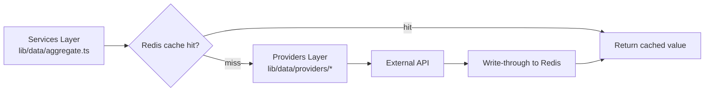
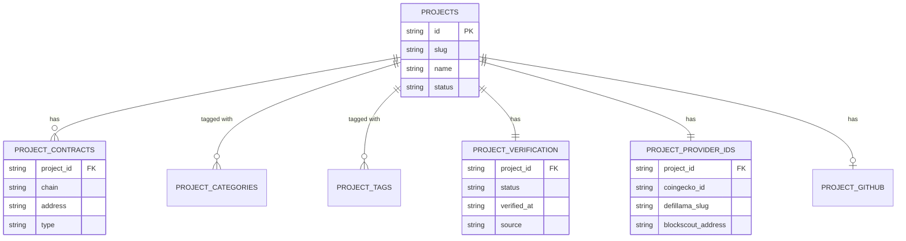

# Database

Base Radar has **no database today**. This document has two purposes: to
record how data is actually modeled and stored right now (plain TypeScript,
in-memory, file-based), and to sketch the PostgreSQL schema, caching
strategy, and relationships that would be introduced once the product
needs persistence beyond a static, version-controlled registry.

Everything under "Future" is **architectural planning only** — none of it
is implemented, and nothing here should be read as scheduled work. It
exists so a future implementation has a documented starting point instead
of starting from zero.

## Current Data Model

There is no database dependency in `package.json` — no Prisma, no `pg`, no
ORM, no query client of any kind. Two independent, unrelated data models
exist today, neither backed by persistent storage of its own:

1. **The Project Registry** (`data/projects/`) — static data, checked into
   version control as TypeScript source files, loaded into memory at build
   time like any other module. This is Base Radar's closest thing to a
   "database" today: it has a schema, a stable identity per row, and query
   helpers — it just has no storage engine, no writes at runtime, and no
   query language beyond plain array methods.
2. **Dashboard data** (`lib/data/`) — not stored anywhere. Each request
   either fetches live data from an external API (cached only at the HTTP
   layer, see [Caching Strategy](#caching-strategy)) or falls back to a
   typed mock constant compiled into the bundle. Nothing here is a
   candidate for a database in its current form; it's transient,
   read-through data, not state Base Radar owns.

## Project Registry

The registry is one flat entity type, `Project`, with everything else
nested inside it rather than split into separate stores:

```
Project
 ├─ id, slug, name                     identity
 ├─ shortDescription, description      copy
 ├─ logoUrl, websiteUrl                media / links
 ├─ categories: ProjectCategory[]      enum array (embedded)
 ├─ tags: ProjectTag[]                 enum array (embedded)
 ├─ status: ProjectStatus              enum (embedded)
 ├─ chains: Chain[]                    enum array (embedded)
 ├─ contracts: ProjectContract[]       embedded list — { chain, address, type, label? }
 ├─ github?: GithubRepoRef             embedded, optional — { owner, repo?, url }
 ├─ social: SocialLinks                embedded — { twitter?, discord?, telegram?, farcaster? }
 ├─ verification: ProjectVerification  embedded — { status, verifiedAt?, source?, notes? }
 └─ providerIds: ProjectProviderIds    embedded — { coingeckoId?, dexscreenerChainId?,
                                          dexscreenerPairAddresses?, defillamaSlug?,
                                          blockscoutAddress?, baseRpcAddress? }
```

Enumerated fields (`categories`, `tags`, `status`, `chains`, and
`ProjectContract.type`) are constrained by `as const` tuples in
`data/projects/enums.ts` (`ProjectCategory`, `ProjectTag`, `ProjectStatus`,
`Chain`, `ContractType`, `VerificationStatus`) rather than a database enum
type or a foreign key to a lookup table.

"Storage" is one file per project under `data/projects/seed/*.ts`,
aggregated into a single `SEED_PROJECTS: Project[]` array by
`seed/index.ts`. "Querying" is `data/projects/helpers.ts` — plain
`Array.find`/`filter` over that in-memory array (`getProject`,
`getProjectsByCategory`, `getProjectsByTag`,
`getProjectsByVerificationStatus`, `searchProjects`). There is no query
planner, no index, and no need for one yet: the full registry is ~20 rows
and is read, never written, at runtime.

## Caching Strategy

There is no application-level or database-level cache today. Caching that
exists is entirely Next.js's built-in `fetch` data cache, configured
per-provider in `lib/data/providers/*` via `next: { revalidate: <seconds> }`:

| Provider | Revalidate window |
| --- | --- |
| Base RPC (`baseRpc.ts`) | 20s |
| Blockscout (`blockscout.ts`) | 60s |
| DexScreener (`dexscreener.ts`) | 60s |
| CoinGecko (`coingecko.ts`) | 90s |
| DefiLlama (`defillama.ts`) | 120s |
| GitHub (`github.ts`) | 600s |

One documented exception: DefiLlama's `/protocols` endpoint returns a
multi-megabyte payload too large for Next's data cache, so
`defillama.ts` fetches it with `cache: "no-store"` instead of a revalidate
window — it is deliberately never cached.

The Project Registry needs no caching strategy today: it is static data
compiled into the server bundle, not fetched at request time.

**Future**: if a real database is introduced, the two-tier pattern already
in place (fresh-ish live data over a stable fallback) would extend
naturally into a read-through cache in front of Postgres — e.g. a
short-TTL cache (in-memory or Redis) for provider responses keyed by
project + provider, so repeated dashboard renders don't refetch external
APIs more often than each provider's own revalidate window already allows,
and a longer-TTL or event-invalidated cache for registry reads once the
registry itself moves off static files.

## Future Redis Cache

Planning note, not implemented. A dedicated Redis (or equivalent in-memory
store) layer would most likely sit between the Services Layer and the
Providers Layer — the same seam `aggregate.ts` already owns:



Candidate uses, each independent and adoptable on its own:

- **Provider response cache** — keyed by provider + query params, TTL
  matched to (or slightly longer than) each provider's existing
  `revalidate` window, reducing redundant calls across concurrent requests
  and multiple server instances (Next's `fetch` cache is per-instance;
  Redis would be shared across a horizontally scaled deployment).
- **Rate-limit protection** — a shared cache is the natural place to
  enforce a soft rate limit against providers with strict caps (GitHub's
  60 req/hour unauthenticated limit, see [API.md](API.md#github)), since it
  can coordinate across server instances in a way per-instance `fetch`
  caching cannot.
- **Session/derived-data cache** — once accounts or wallet connect exist
  (see the Portfolio milestone in [ROADMAP.md](ROADMAP.md)), short-lived
  per-user computed data would be a natural fit for Redis rather than
  Postgres.

## Indexes

There are no indexes today, because there is no database. The Project
Registry's only "index" is the in-memory array itself; a linear scan over
~20 items has no meaningful cost.

**Future** — once the registry moves to PostgreSQL, the natural indexes
follow directly from the current query helpers:

| Index | Backs |
| --- | --- |
| Unique index on `projects.slug` | `getProject(idOrSlug)` |
| Unique index on `projects.id` (or use `id` as primary key) | `getProject(idOrSlug)` |
| GIN index on `project_categories.category` | `getProjectsByCategory()` |
| GIN index on `project_tags.tag` | `getProjectsByTag()` |
| Index on `project_verifications.status` | `getProjectsByVerificationStatus()` |
| Full-text (`tsvector`) index on `name`, `short_description` | `searchProjects()` |

## Relationships

Today, there are no relationships in the database sense — everything lives
inside a single `Project` object, and "related" data (contracts, GitHub
ref, social links, verification, provider ids) is embedded, not joined.

**Future** — normalizing `Project` into PostgreSQL would turn several of
its embedded arrays/objects into related tables:

```
projects (1) ──< project_contracts        (one project, many contracts)
projects (1) ──< project_categories        (many-to-many via join table)
projects (1) ──< project_tags              (many-to-many via join table)
projects (1) ── project_verification       (one-to-one)
projects (1) ── project_provider_ids       (one-to-one)
projects (1) ──< project_github            (one-to-one, optional)
```

`categories` and `tags` would most likely become proper many-to-many
relationships (`project_categories` / `project_tags` join tables against
small lookup tables mirroring today's `PROJECT_CATEGORIES` /
`PROJECT_TAGS` enums), preserving the "closed vocabulary" property the
current `as const` tuples enforce at the type level.



## Future Search Index

Planning note. `searchProjects()` today is a linear, in-memory substring
match over ~20 rows (see [API.md](API.md#registry-api--dataprojectshelpersts))
— adequate at the current registry size, but not something that scales to
a large registry or to fuzzy/typo-tolerant search, both of which the
planned Projects Explorer milestone (see [ROADMAP.md](ROADMAP.md)) would
need.

Two upgrade paths, in increasing order of capability:

- **PostgreSQL full-text search** (`tsvector`/`tsquery`, already listed
  under [Indexes](#indexes)) — the smallest step up, no new infrastructure
  beyond the planned Postgres database itself. Sufficient for
  keyword-style search over name/description/tags.
- **A dedicated search engine** (e.g. Meilisearch, Typesense, or
  Elasticsearch/OpenSearch) — worth considering only if search needs grow
  beyond what Postgres full-text search comfortably handles (typo
  tolerance, faceted filtering by category/tag/chain at scale, ranking
  tuned independently of the primary datastore).

No decision has been made between these — Postgres full-text search is the
lower-risk default until there's a concrete reason to run a second
datastore just for search.

## Future Vector Database

Planning note, tied to the AI Research pillar in
[PRODUCT_VISION.md](PRODUCT_VISION.md#product-pillars). A vector database
(or a vector extension on Postgres, e.g. `pgvector`) would only become
relevant once Base Radar needs **semantic** rather than keyword matching —
for example:

- Finding projects "similar to X" by embedding `shortDescription` /
  `description` rather than matching on shared tags/categories.
- Powering a natural-language research assistant over the Project
  Registry and Intelligence Engine output (see
  [ARCHITECTURE.md](ARCHITECTURE.md#future-intelligence-engine)).

This is speculative and has no concrete design yet — it is listed here
because it's a predictable next step for the AI Research milestone in
[ROADMAP.md](ROADMAP.md), not because any embedding pipeline exists today.

## Future Analytics Database

Planning note. Every value the dashboard shows today (TVL, gas, KPIs,
signals) is a **current snapshot** — nothing is persisted over time, so
there is no way to answer "what was TVL yesterday" from Base Radar itself
(historical sparklines in `lib/data/mock.ts` are illustrative mock data,
not stored history). A future analytics store would change that:

- **Likely shape**: a time-series-oriented store (e.g. TimescaleDB as a
  Postgres extension, or a dedicated columnar store like ClickHouse if
  volume grows beyond what Postgres comfortably handles) recording periodic
  snapshots of KPI/TVL/signal values keyed by timestamp.
- **Would power**: real historical sparklines (replacing today's mock
  `SparklinePoint[]` data with real series), trend analysis in the
  Intelligence Engine, and the Signals & Alerts milestone's need to detect
  a *change* over time rather than a single point-in-time read.
- **Relationship to caching**: distinct from the Redis cache above — a
  cache stores the *latest* value for a short time; an analytics database
  would durably store *every* observed value for historical analysis.

## Future Tables

Speculative table list, grouped by what part of the product it would
support — grounded in the milestones already named in
[ROADMAP.md](ROADMAP.md) and [PRODUCT_VISION.md](PRODUCT_VISION.md), not
invented beyond them:

**Project Registry (normalized)**
- `projects` — core identity/copy fields, replacing `data/projects/seed/*.ts`
- `project_contracts` — one row per `ProjectContract`
- `project_categories`, `project_tags` — join tables against enum lookup tables
- `project_verifications` — one row per project's `ProjectVerification`
- `project_provider_ids` — one row per project's `ProjectProviderIds`

**Provider Layer / Aggregator (planned milestones)**
- `provider_cache` — durable cache of last-known-good provider responses per
  project, so a registry entry can show a "last known" value instead of
  falling back to generic mock data when a provider is briefly down

**Portfolio (planned milestone)**
- `users` — account identity, if/when accounts exist
- `wallets` — wallet addresses linked to a user, replacing `getPortfolioSummary()`'s mock data
- `wallet_holdings` — cached balance snapshots per wallet

**Signals & Alerts (planned milestones)**
- `signals_history` — persisted signal events, superseding the in-memory-only `Signal[]` shape
- `alert_rules` — user-configured alert conditions
- `alert_deliveries` — sent-alert log, for dedupe and history

**Watchlist (extends existing mock `WatchlistItem`)**
- `watchlist_items` — persisted per-user watchlist, replacing `MOCK_WATCHLIST`

None of these tables exist. They are listed here strictly as a planning
reference for how today's typed shapes (`Project`, `PortfolioSummary`,
`Signal`, `WatchlistItem`, etc., all defined in `lib/data/types.ts` and
`data/projects/types.ts`) would map onto relational storage if and when
Base Radar needs one.
