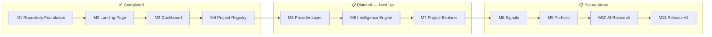

# Roadmap

Base Radar ships in numbered milestones rather than on a fixed calendar —
each milestone is a coherent, independently useful slice of the product.
This document tracks what's shipped, what's actively underway, and what's
planned next.

Milestone numbering here matches [docs/GITHUB_MILESTONES.md](GITHUB_MILESTONES.md).
For the product reasoning behind these milestones, see
[PRODUCT_VISION.md](PRODUCT_VISION.md#long-term-roadmap). For
release-by-release detail, see [CHANGELOG.md](CHANGELOG.md).

## Status Legend

| Status | Meaning |
| --- | --- |
| ✅ Completed | Shipped and merged |
| 🚧 In Progress | Actively being built |
| 📋 Planned | Scoped, not yet started |

## Completed

| # | Milestone | Summary |
| --- | --- | --- |
| 1 | **Repository Foundation** | Next.js App Router project scaffolded with TypeScript, Tailwind CSS v4, ESLint, and the base-nova/Base UI component conventions the rest of the app builds on. |
| 2 | **Landing Page** | Marketing homepage — animated hero, live network stat cards, trust indicators, navbar, footer — then wired so the hero CTA and navbar both launch the dashboard. |
| 3 | **Dashboard** | Sidebar, topbar, command palette, and the full widget set (Portfolio, Market, Trending, AI Projects, Whale Activity, Signals, Project Spotlight, Activity Feed, Narrative Heatmap, Watchlist), backed by a typed data layer with mock fallback; premium light theme; unified navigation between the marketing site and dashboard. |
| 4 | **Project Registry** | Canonical, strongly-typed registry of ~20 verified Base ecosystem projects — schema, enums, seed data, query helpers, barrel export — plus the documentation foundation (README, Product Vision, Architecture, this Roadmap, and the rest of `/docs`). |

## In Progress

Nothing is currently in progress.

> **Note on drift**: the milestone numbering below (M5–M11) predates a large
> amount of work that has since shipped outside this numbering — including a
> Project Explorer, Project Profile pages, a Watchlist, and the Alert Engine
> / AI Intelligence feature described below. This document has not been
> renumbered to reflect that; treat the ✅ Completed table above and this
> section as the two sources of truth for what's actually shipped, and the
> M5–M11 milestones below as directional planning from an earlier point in
> the project rather than a current, accurate backlog.

## Alert Engine & AI Intelligence

**Status**: ✅ Shipped

A real-time-feeling (but not polling) alert feed for Watchlist projects,
sourced from the existing Provider Layer (GitHub, Snapshot, CoinGecko,
DefiLlama, Blockscout — no new providers), plus a deterministic, rule-based
"AI Intelligence" layer on top that groups a project's alerts into one
scored, narrative-classified read instead of a wall of disconnected
notifications. No external AI API is used — narratives and summaries are
generated from fixed rules and templates over real, already-fetched data.
See [ARCHITECTURE.md](ARCHITECTURE.md#alert-engine--ai-intelligence) for the
pipeline and [API.md](API.md#alert-engine--ai-intelligence-api) for the
function reference.

## AI Daily Intelligence Brief

**Status**: ✅ Shipped

A searchable, filterable executive summary built entirely on top of the AI
Intelligence Engine's own output (`getIntelligenceAlerts()`) — never a
second data source. One headline and executive summary, plus Market
Summary, Top Opportunities, Security/Governance/Development/TVL
Highlights, Emerging Narratives, and Recommendations sections, each shown
only when it has real data. Surfaced as a compact Dashboard widget and a
dedicated `/dashboard/brief` page. Deterministic template prose — no
external AI API. See [ARCHITECTURE.md](ARCHITECTURE.md#daily-brief) for the
pipeline and [API.md](API.md#daily-brief-api) for the function reference.

## Portfolio Intelligence

**Status**: ✅ Shipped

A searchable, filterable per-Watchlist read, one level above Daily Brief:
where a Daily Brief summarizes the day's Intelligence Alerts market-wide,
Portfolio Intelligence scopes that same output to the current Watchlist —
overall health, top performers, projects needing attention, security
risks, governance watch, development momentum, dominant narratives, and
recommendations. Built entirely from `getWatchlist()`, `getIntelligenceAlerts()`,
and `getDailyBrief()` — no new scoring or narrative logic, no provider
calls. Surfaced as a compact Dashboard widget and a dedicated
`/dashboard/portfolio` page. Deterministic template prose — no external AI
API. See [ARCHITECTURE.md](ARCHITECTURE.md#portfolio-intelligence) for the
pipeline and [API.md](API.md#portfolio-intelligence-api) for the function
reference.

## Intelligence Timeline

**Status**: ✅ Shipped

A searchable, filterable, chronological activity feed — a merge point, not
another intelligence engine — combining Intelligence Alerts, Daily Brief,
and Portfolio Intelligence output into one time-ordered feed grouped into
Today/Yesterday/Earlier. Ten event types (Alerts, Opportunities, Security,
Governance, Development, TVL, Narratives, Recommendations, Portfolio,
Daily Brief), each rendered with real severity/confidence/score where a
project-scoped event genuinely has one, and honestly `null` for the
aggregate-level events that don't. Built entirely from
`getIntelligenceAlerts()`, `getDailyBrief()`, and
`getPortfolioIntelligence()` — no new scoring or narrative logic, no
provider calls. Surfaced as a compact Dashboard "Recent Activity" widget
and a dedicated `/dashboard/timeline` page with search, event-type
filtering, and sorting (Newest/Oldest/Highest Severity/Highest Confidence).
See [ARCHITECTURE.md](ARCHITECTURE.md#intelligence-timeline) for the
pipeline and [API.md](API.md#intelligence-timeline-api) for the function
reference.

## Milestone 5 — Provider Layer

**Status**: 📋 Planned

Extend live-provider integration so Project Registry entries — not just
dashboard widgets — can be enriched with real market and on-chain data,
using the `providerIds` already defined on every `Project` (see
[PROJECT_REGISTRY.md](PROJECT_REGISTRY.md#how-provider-ids-work)). This is
the prerequisite for Milestones 6 and 7.

## Milestone 6 — Intelligence Engine

**Status**: 📋 Planned

A general-purpose synthesis layer above today's per-widget aggregator,
joining the Project Registry with live provider data and replacing the
curated mock narrative/category classification currently behind
`getTrendingNarratives()` and `getNarrativeHeatmap()`. See
[ARCHITECTURE.md](ARCHITECTURE.md#future-intelligence-engine) for the
planned shape.

## Milestone 7 — Project Explorer

**Status**: 📋 Planned

A browsable, filterable, searchable view over the full Project Registry —
the first UI surface to read the Registry directly rather than through the
dashboard's curated widgets. Depends on Milestone 5 for live enrichment and
benefits from Milestone 6 for ranking/classification.

## Future Ideas

Named milestones, scoped but not yet started, along with looser
directional ideas:

| # | Milestone | Summary |
| --- | --- | --- |
| 8 | **Signals** | Configurable, rules-based detection of notable market/on-chain activity, superseding today's curated Signals widget; a first consumer of the Intelligence Engine. |
| 9 | **Portfolio** | Wallet-connected, real portfolio tracking, replacing the current mock Portfolio and Watchlist widgets. |
| 10 | **AI Research** | Dedicated research tooling for the AI-agent segment of the Base ecosystem, including a Project Details view. |
| 11 | **Release v1** | Hardening, polish, and readiness work for a public v1.0 release — see [RELEASES.md](RELEASES.md) for the versioning strategy this targets. |

Looser ideas, not yet scoped into a milestone:

- Alerts (notifications layered on top of Signals)
- Public API access to the Project Registry (see [API.md](API.md#future-api-endpoints))
- Historical analytics/sparklines backed by a real time-series store (see [DATABASE.md](DATABASE.md#future-analytics-database))

## Notes

- Milestone order reflects logical dependency (Provider Layer before
  Intelligence Engine before Project Explorer), not a committed schedule.
- See [GITHUB_MILESTONES.md](GITHUB_MILESTONES.md) for how these map to
  actual GitHub milestone objects, and
  [GITHUB_LABELS.md](GITHUB_LABELS.md) for the label taxonomy used to
  triage issues against them.
