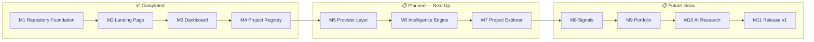

# Roadmap

Base Radar ships in numbered milestones rather than on a fixed calendar —
each milestone is a coherent, independently useful slice of the product.
This document tracks what's shipped, what's actively underway, and what's
planned next.

Milestone numbering here matches [docs/GITHUB_MILESTONES.md](GITHUB_MILESTONES.md).
For the product reasoning behind these milestones, see
[PRODUCT_VISION.md](PRODUCT_VISION.md#long-term-roadmap). For
release-by-release detail, see [CHANGELOG.md](CHANGELOG.md).

## Status Legend

| Status | Meaning |
| --- | --- |
| ✅ Completed | Shipped and merged |
| 🚧 In Progress | Actively being built |
| 📋 Planned | Scoped, not yet started |

## Completed

| # | Milestone | Summary |
| --- | --- | --- |
| 1 | **Repository Foundation** | Next.js App Router project scaffolded with TypeScript, Tailwind CSS v4, ESLint, and the base-nova/Base UI component conventions the rest of the app builds on. |
| 2 | **Landing Page** | Marketing homepage — animated hero, live network stat cards, trust indicators, navbar, footer — then wired so the hero CTA and navbar both launch the dashboard. |
| 3 | **Dashboard** | Sidebar, topbar, command palette, and the full widget set (Portfolio, Market, Trending, AI Projects, Whale Activity, Signals, Project Spotlight, Activity Feed, Narrative Heatmap, Watchlist), backed by a typed data layer with mock fallback; premium light theme; unified navigation between the marketing site and dashboard. |
| 4 | **Project Registry** | Canonical, strongly-typed registry of ~20 verified Base ecosystem projects — schema, enums, seed data, query helpers, barrel export — plus the documentation foundation (README, Product Vision, Architecture, this Roadmap, and the rest of `/docs`). |

## In Progress

Nothing is currently in progress. Milestone 4 (Project Registry &
Documentation) is the most recently completed work; Milestone 5 has not yet
started. This section will list active work once a milestone below moves
from Planned to In Progress.

## Milestone 5 — Provider Layer

**Status**: 📋 Planned

Extend live-provider integration so Project Registry entries — not just
dashboard widgets — can be enriched with real market and on-chain data,
using the `providerIds` already defined on every `Project` (see
[PROJECT_REGISTRY.md](PROJECT_REGISTRY.md#how-provider-ids-work)). This is
the prerequisite for Milestones 6 and 7.

## Milestone 6 — Intelligence Engine

**Status**: 📋 Planned

A general-purpose synthesis layer above today's per-widget aggregator,
joining the Project Registry with live provider data and replacing the
curated mock narrative/category classification currently behind
`getTrendingNarratives()` and `getNarrativeHeatmap()`. See
[ARCHITECTURE.md](ARCHITECTURE.md#future-intelligence-engine) for the
planned shape.

## Milestone 7 — Project Explorer

**Status**: 📋 Planned

A browsable, filterable, searchable view over the full Project Registry —
the first UI surface to read the Registry directly rather than through the
dashboard's curated widgets. Depends on Milestone 5 for live enrichment and
benefits from Milestone 6 for ranking/classification.

## Future Ideas

Named milestones, scoped but not yet started, along with looser
directional ideas:

| # | Milestone | Summary |
| --- | --- | --- |
| 8 | **Signals** | Configurable, rules-based detection of notable market/on-chain activity, superseding today's curated Signals widget; a first consumer of the Intelligence Engine. |
| 9 | **Portfolio** | Wallet-connected, real portfolio tracking, replacing the current mock Portfolio and Watchlist widgets. |
| 10 | **AI Research** | Dedicated research tooling for the AI-agent segment of the Base ecosystem, including a Project Details view. |
| 11 | **Release v1** | Hardening, polish, and readiness work for a public v1.0 release — see [RELEASES.md](RELEASES.md) for the versioning strategy this targets. |

Looser ideas, not yet scoped into a milestone:

- Alerts (notifications layered on top of Signals)
- Public API access to the Project Registry (see [API.md](API.md#future-api-endpoints))
- Historical analytics/sparklines backed by a real time-series store (see [DATABASE.md](DATABASE.md#future-analytics-database))

## Notes

- Milestone order reflects logical dependency (Provider Layer before
  Intelligence Engine before Project Explorer), not a committed schedule.
- See [GITHUB_MILESTONES.md](GITHUB_MILESTONES.md) for how these map to
  actual GitHub milestone objects, and
  [GITHUB_LABELS.md](GITHUB_LABELS.md) for the label taxonomy used to
  triage issues against them.
